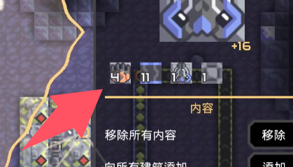

# 操作逻辑优化
### 选择界面与设置界面的跳转逻辑
 选择建筑后，弹出的设置界面会因鼠标点击界面之外而转到选择建筑界面，再次点击才能转到设置界面，有些反逻辑  
<video controls src="QQ202496-15828.mp4" title="Title"></video>
调整为，选择建筑后，不会再跳转至选择界面

### 右键直接从设置栏位里取消选择
少数有多选一类建筑的情况，右击对应建筑图标即可取消选择  

### 继承
删除 原来的继承攻击优先级  

改为复制的建筑会继承被复制建筑的所有设置，包括生命是否为无限，某些物品是否无限，电力是否无限，热力是否为无限，攻击限制级，攻击优先级等等  

记录下建筑的设置，在重建时复原原来的设置，尤其是攻击优先级
### 分类器的批量设置
名为：**分类**  
包括各种可以进行分类的建筑  
`如：分类器，物品源`
### 设置添加一个无限火力
分为弱与强
# 视觉优化
### 右键框定选择时，选择框先变红，松开右键再消失

