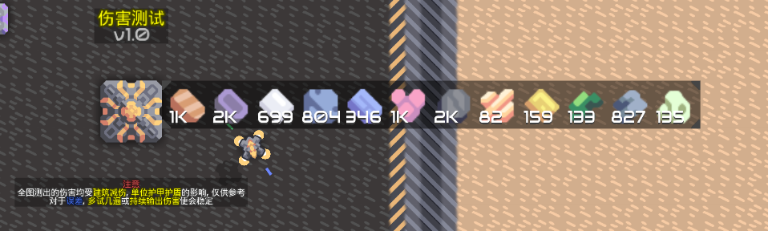
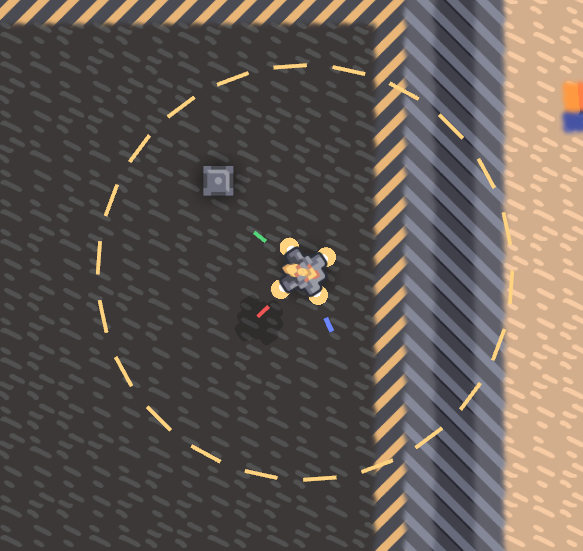

# 建造消耗预计
预计建造规划中所有建筑的建造时间和资源  
建造预计资源显示在原版的资源栏位上  
建造时间显示在鼠标或建造规划的几何中心上（玩家自调整）
### UI
# 建筑内容物查看界面自定义
可以在一定范围内自定义一行展示的物品数量  

# 显示单位索敌范围
鼠标悬浮在单位上显示  
仅显示我方  

# 显示当前 炮台/单位 索敌目标
当鼠标悬浮在炮台或单位上时，显示其索敌目标  
显示的样式即原版进入建筑时的光标  
  
若玩家正在操控炮台或单位（除玩家单位外），鼠标会变成  
  
这个图标就是玩家操控单位自动索敌时的  
仅限装填速度高于1秒的建筑，在这个图标以下，会显示装填状态的进度条
# 分类器显示物品图标
显示图标的情况下，背景不透明度降低至较为舒适的程度  

# 质驱发射方向显示
可调常亮和仅鼠标悬浮，默认关闭

# 全局显示范围
包括我方单位炮台索敌范围，治疗范围，加速范围等