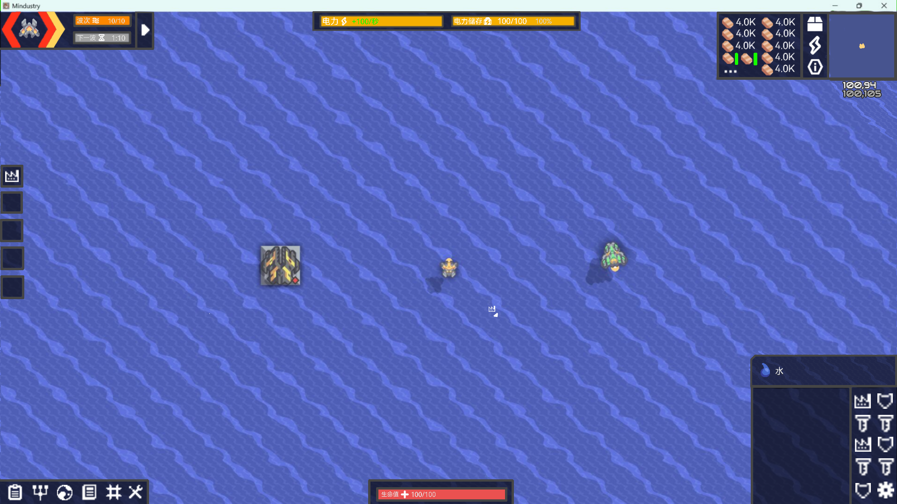
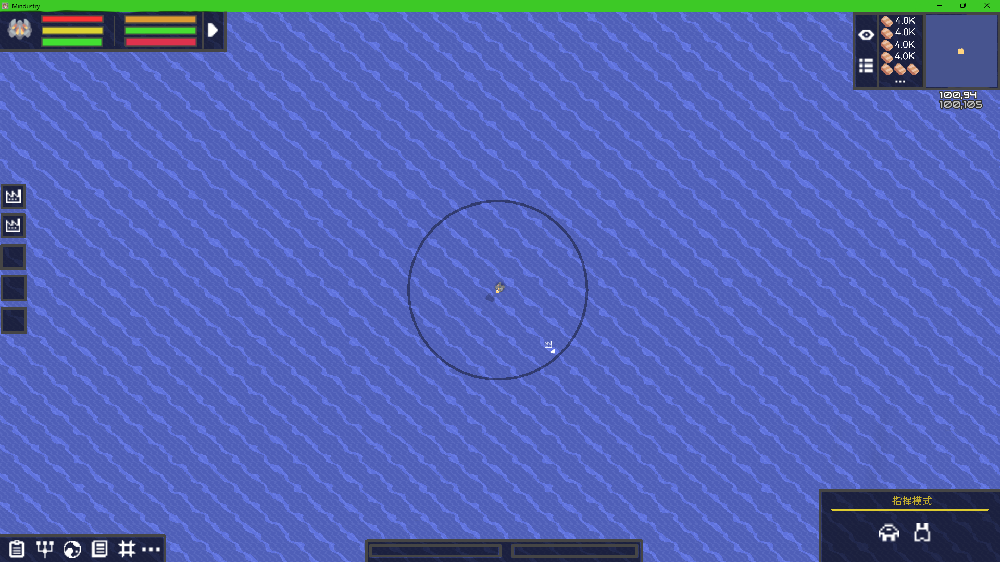

# 提要
由于添加的物品和功能很多，原版的UI已经满足不了一些大更改的需求，需要对UI进行重构，嵌入一些辅助功能和更人性化的设计
## UI概要
### 常态界面
- [地图与资源栏合并](建筑栏选择栏.md)
- [优化建筑选择栏](建筑栏选择栏.md)
- [告警栏](告警栏.md)
- [自身状态栏和波次栏显示数据细化](状态&波次栏.md)
- [电力栏与快捷栏](电力&快捷栏.md)
- [功能栏](指挥栏.md)（设置模式等辅助功能都可以放这里）
- [信息栏显示优化](信息栏.md)

### 指挥界面
- 可以控制建筑  
[指挥栏](指挥栏.md)

