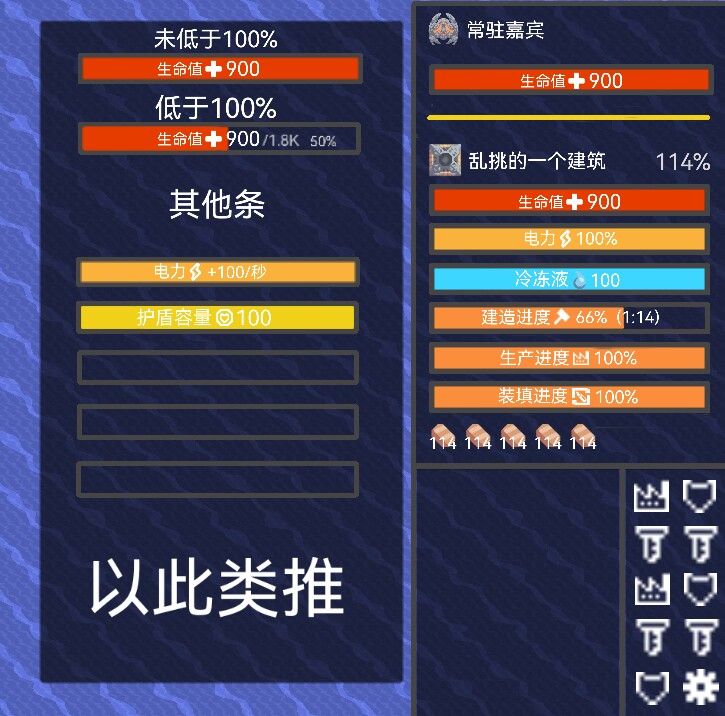

# 更加精细的数据显示
## 基础数据细化
生命值，液体，弹药，电力等拥有了更加精细的数据显示，玩家能在设置中挑选并设置  
- 生命值：具体数值，上限，百分比，红色  

- 液体（对应液体贴图）：具体数值，上限，对应颜色  
- 电力：橙黄色  
针对不同建筑，有不同的显示类型：  
  - 电力节点：显示具体数值（白色，不会变色），百分比  
  - 需电建筑：效率百分比（常显）
- 电力储量：具体数值，上限，百分比，橙黄色
- 电力输出：具体数值，上限，百分比  
针对一些需要电力启动的电厂，需要显示负电力
- 弹药（对应弹药贴图）：剩余可发射次数或剩余弹药数，橙黄色
- 制造进度（即单位生产的进度）  ：百分比和预计时间（算加速后）
- 护盾容量：具体数值，上限，百分比
- 热量  （未实装内容前）：原版颜色，具体数值，100%效率所需热（上限？），百分比，所有数据常显
- 挖掘速度（采集的资源种类图标）：具体速度
- 物品数量：仅添加一个图标，因为这个实在没有什么实际用途
- 载荷容量  ：具体数值
### 新增数据
- 状态：即原版的状态提示灯，仅建筑，提供信息描述，不同建筑有不同的状态描述
- 装填  ：百分比，橙黄色，仅针对弹药装填较慢的炮台（在未有任何速度加成时，**每次开火**时间超过1秒的炮台，如恶兆，熔毁）
- 生产  ：百分比，橙黄色，仅针对生产速度慢的工厂
- 效率  ：实际效率，包括电力，热量，液体冷却，超速，效果等影响，显示在状态右侧
- 预热：即在开火之前的启动阶段，百分比，橙黄色，仅限预热时间超过1s的炮台，参考学术端
- 效果：显示当前单位建筑目前受到的效果及其持续时间，位于逻辑下方，也是信息栏的最下方
- 电离能量 （未实装）：具体数值，上限

- 热容  （未实装）：

### 特别说明-状态
不同建筑有不同的状态说明：  
- 通用  
缺少条件，红  
效率低，1秒内在红绿之间切换  
工作中，绿（位置建筑类型也用这个）
- 工厂，采集等  
生产中，绿  
已满，橙  
拥堵，0.5秒内在绿红之间切换
- 炮台  
开火中，绿  
预热中，绿，仅限有预热条的炮台  
寻敌中，橙  
- 电池  
已满，绿  
充电中，绿    
放电中，橙   
待使用，橙（未满电且没有电量变化时）  
无电量，红
### 单位与建筑可以同时显示
防止单位与建筑重合而看不见建筑的信息  
## UI
无特殊说明时（通用）：    
- 百分比取整数  
- 上限和百分比在满状态或零时不显示，当补充到满时，1秒后将消失（过程过渡0.5秒，共1.5秒）  
当从100%降低或从零上涨后，1秒后才会显示上限和百分比（过度0.5秒，共1.5秒）  
上限和百分比显示在数字的右下角，颜色稍淡（白色75%），字体大小为**具体数值大小**的66%  
**上限百分比的显示不会挤掉数值的居中位置（上限和百分比只会多出在具体数值后面）**
  

