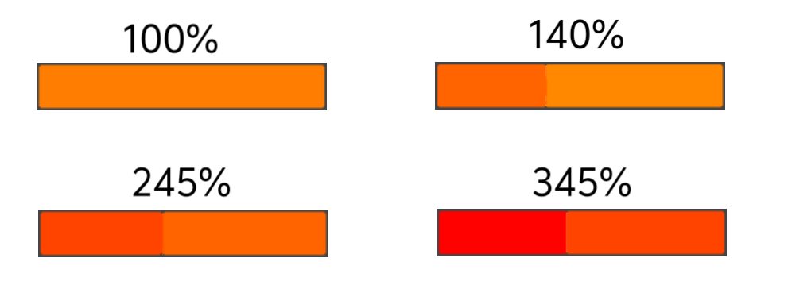

# 更加精细的数据显示
## 基础数据细化

生命值，液体，弹药，电力等拥有了更加精细的数据显示，玩家能在设置中挑选并设置  
- 生命值：具体数值，上限，百分比，红色  

- 液体（对应液体贴图，默认显示）：具体数值，上限，对应颜色  
- 电力(用原版自带的图标)：橙黄色  
针对不同建筑，有不同的显示类型：  
  - 电力节点：显示具体数值（白色，不会变色），百分比  
  - 需电建筑：效率百分比（常显）
- 储存：具体数值，上限，百分比，橙黄色
- 净输出（原版）：具体数值，上限，百分比  
针对一些需要电力启动的电厂，需要显示负电力
- 弹药（对应弹药贴图，默认显示）：剩余可发射次数或剩余弹药数，橙黄色
- 制造（即单位生产的进度）  ：百分比和预计时间（算加速后）
- 护盾容量：具体数值，上限，百分比
- 热量  （原版）：具体数值，100%效率所需热（上限？），百分比，所有数据常显，颜色会根据当前效率额外填充更加红的颜色  
如：一个400%满效率的建筑，在100%效率时，填充满原版的橙黄色，若效率为140%，有介于橙黄到红色的颜色**覆盖**在原来橙黄色上  
颜色选择根据建筑的最高效率来定，100%效率固定为原版橙黄色，满效率固定为橙红色（不完全红），中间的200%，300%等，从橙黄到橙红均匀变化  
可以试试看在覆盖的颜色上加一层比较薄的描边，看情况再说

- 挖掘速度（采集的资源种类图标）：具体速度（固定保留两位小数）
- 物品数量（原版）：仅添加一个图标，因为这个实在没有什么实际用途
- 载荷容量  ：具体数值  
- 超速：百分比  
- 泵送速度（对应液体图标）：具体数值
### 新增数据
- 状态：即原版的状态提示灯，仅建筑，提供信息描述，不同建筑有不同的状态描述
- 生产  ：百分比，橙黄色，仅针对生产速度慢的工厂
- 效率 ：实际效率，包括电力，热量，液体冷却，超速，效果等影响，显示在状态右侧
- 装填  ：百分比，橙黄色，仅针对弹药装填较慢的炮台（在**没有任何速度加成**时，**每次开火**时间超过1秒的炮台，如恶兆）
- 启动：即在开火之前的启动阶段，百分比，橙黄色，仅限启动时间超过0.5s的炮台，因为炮台不同，启动阶段有不同的原理和描述，分不同的图标和文字描述，未知类型或来自mod的炮台统一用**启动**  
  -  充能 (原版)：魔灵
  -  预热 （原版）：

- 冷却 （原版或者风扇）：需要冷却的炮台（熔毁），百分比，橙黄色
- 效果：显示当前单位建筑目前受到的效果及其持续时间，位于逻辑下方（图示中空出的位置），也是信息栏的最下方
- 电离能量 （未实装）：具体数值，上限

### 特别说明-状态
不同建筑有不同的状态说明：  
- 通用  
缺少条件，红  
效率低，1秒内在红绿之间切换  
工作中，绿（位置建筑类型也用这个）
- 工厂，采集等  s
生产中，绿  
已满，橙  
拥堵，0.5秒内在绿橙之间切换
- 炮台  
开火中，绿  
启动中，绿，仅限有启动条的炮台  
冷却中，绿，仅限需要冷却的炮台  
寻敌中，橙  
- 电池  
已满，绿  
充电中，绿    
放电中，橙   
待使用，橙（未满电且没有电量变化时）  
无电量，红
### 单位与建筑可以同时显示
防止单位与建筑重合而看不见建筑的信息  
## UI
无特殊说明时（通用）：    
根据上限决定上限和具体数值的数据显示精度：    
- 上限和具体数值  
上限小于等于100时，才会显示小数后一位（99.9）  
上限小于等于10时，显示后两位（9.99）  
上限大于100不显示小数  
上限大于等于10000时，才会略写为10.0K，略写后，大于100k后，不保留小数  
上限超过1000k后，略写为1.00M，保留小数规则与上面相同，此后数值依次类推   
上限忽略小数后面的0，具体数值不省略  
`如：具体数值 88 ，上限 8,800 ，应显示 88/8800 1%`  
`具体数值 4 ，上限 80 ，应显示 4.0/80 5%`  
`具体数值 2.5 ，上限 5 ，应显示 2.50/5 50%`  
`具体数值 2.5 ，上限 7.5 ，应显示 2.50/7.5 33%`  
`具体数值 8,880 ， 上限 8,880 ，应显示 8880/8880 100%`  
`具体数值 12,890 ， 上限 25,000 ，显示 12.8k/25k 52%`

- 百分比取整数，小于1%显示<1%，小于0.01%，直接显示0%   
`如：具体数值 80 ，上限 12,000 ，应显示 80/12K <1%`  
`具体数值 50 ，上限 100,000 ，应显示 50/100K 0%`  

- 上限和百分比在满状态或零时不显示，**当补充到满或下降至零时**，0.5秒后将消失，过程过渡1秒，共1.5秒  
当从100%降低或从零上涨后，不处于100%或0%两种状态0.5秒后才会显示上限和百分比，过渡1秒，**若在前面的0.5秒内有一次再次回到100%或0%，则重新开始计时（注意，这个仅限从消失到显示这个过程）**  
上限和百分比显示在数字的右下角，颜色稍淡（白色75%），字体大小为**具体数值大小**的66%  

