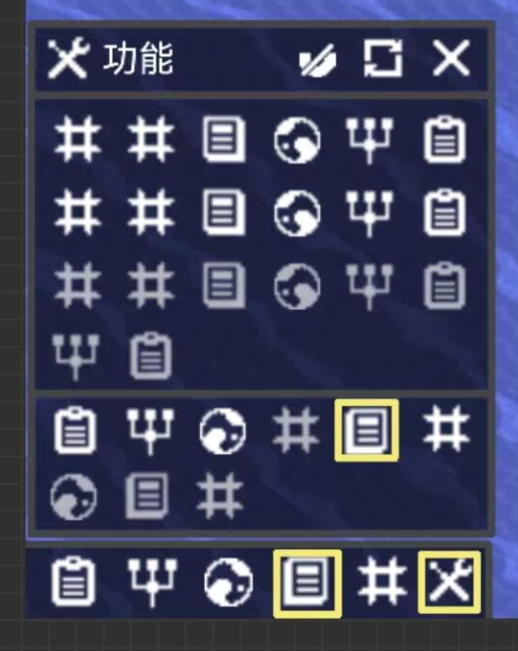
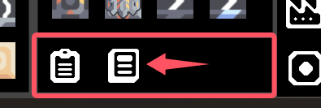
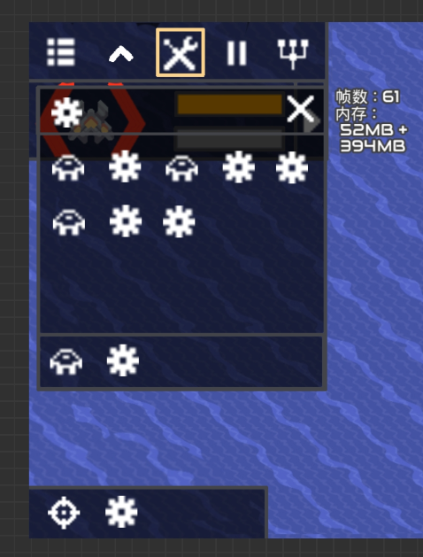

# 功能栏
容纳各种功能的地方，如设置模式，科技树，cooker等  
可以设置快捷显示何种功能  

### 快捷功能栏
高度与建筑栏的工具栏一致，每一个图标大小也是
  
与原版右下角功能栏类似：  
悬停背景高亮，显示功能名称，点击黄框高亮  
若是持续性的就常亮（打开设置模式）  
若是瞬间性的就闪一下（打开科技树，打开核心数据库）  
若是多项选择，则在鼠标旁弹出窗口以选择（类似选择启用的界面），部分功能可以用图标展示当前状态（比如：强弱无限火力）
### 功能菜单
功能菜单用[窗口](窗口.md)显示  
实际相当于一个所有功能的菜单，可以打开功能和编辑快捷功能栏

- 点击   激活高亮黄框并向上弹出功能菜单，仅能再次点击  或点击  也可关闭界面并记住位置，游戏重启也不会重置  

- 窗口上部分显示所有的功能，下方为展示在快捷功能栏的功能  
- 鼠标悬停在任意图标上，图标背景会高亮，显示功能名称  
点击图标即可打开对应功能，右击可以快捷将功能移入快捷功能栏  
在快捷栏中右击也可反着将功能移入菜单   
- 右键拖动可以将功能移动至特定位置，改变相对位置，也可以移动至快捷栏  
- 功能菜单中可以在下方添加任意数量（或者限制为16个？）的功能，但在快捷功能栏会依次显示当前的功能，至多10个（  不算）
- 初始状态下，窗口大小默认：长为一排5图标，高为一行5图标（算快捷栏一起）  
快捷栏功能任何时候都要去全部显示，所以窗口最小为能够显示所有的快捷栏的功能和窗口本身的最小状态  
- 对功能栏的个性化调整，通用于所有存档（不管玩什么都是一样的）  
若存档不允许使用某种功能或未解锁，该功能直接在列表中消失  
但是在编辑快捷栏时，那些隐藏的功能会变成灰色（66%透明度） 
鼠标悬停在隐藏的功能上时，名称会变成红色，提示被禁用或未解锁
- 可以在设置里面重置对功能栏的个性化设置，位置恢复默认

### 默认处于快捷功能栏的功能
1. pc端  
顺序：蓝图，核心数据库，设置模式，单位生成模式  

2. 手机端  
顺序：指挥模式，设置模式，单位生成模式，蓝图

## 手机端UI
  
其他操作多数一致  
 放置在原来蓝图的位置  
功能栏再扩展至6个以上时，会向上扩展而不是继续往左  
这里可以设计成填补空缺的方式，使双数完全填充快捷栏，单数只留一处空白  
手机版的功能栏会占掉原版指挥模式的位置，在一些模式下，这个功能栏会被占掉
### [大部分功能（文件夹）](../../辅助功能)