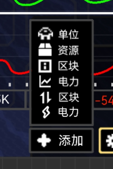

# 区块信息界面(UI for SectorInfo)
显示绝大部分区块的信息  
电脑端初始UI
  
手机端初始UI（简化绘制）  

### 打开和关闭
可以由不同方式打开，再次点击即可关闭，点击返回或ESC关闭  
- 点击快捷键 **I**（info）
- 点击资源栏  图标（鼠标未大范围移动可以点击原位关闭）
- cooker行星终端中直接点击区块详情
  
在统计资料右边添加  **区块详情**   

### UI界面
UI最上方显示区块当前名称，若改过名称，在名称后面显示，（**初始名称**），用括号括起
#### 模块化设计
界面内的内容采用模块化设计，参考手机桌面布局  
- 在UI大小为100%的标准下，界面均分为若干小方块（电脑初始为13x6,手机）   
每个小方块像素固定，计算标准状态下的每一个方块的大小  
- 模块由灰色边框和33%不透明度纯黑组成  
每一个模块都有自己的最小，默认，最大模块尺寸（小方块数）    
- 模块自定义统一到所有存档（改了就全部地图都是这样）  
模块化之后，可以添加更多区块信息，甚至包括没有什么用的建筑数目统计   
- 可以在设置中将个性化恢复至默认
- 模块内元素的排列方式与[窗口](窗口.md)趋同

#### 模块调整
##### 开启
- 点击  **调整** 后，按钮常亮黄框，进入**调整模式**，再次点击关闭或关闭区块信息界面后自动关闭     
- 进入调整后，所有模块都向下弹出界面的名称和关闭按钮  
在背景显示每一个小方块，内容自适应向下移动  
并在右下角显示  **添加**  

##### 模块调整位置和大小
- 拖动模块上部分 可以拖动该模块进行移动  
拖动时，在模块预期位置淡入淡出一层在模块下层的白色框（16%的纯白边框和10%的纯白背景组成）  
若拖动至不能放置的区域，白框整体变红，并会尝试将窗口放置在附近，如果没有任何地方可以放置，则放置在新的页面  
- 悬停在模块边缘的灰边，在灰边上层生成不透明度为66%的黄框，同时鼠标变成对应的移动图标，拖动即可调整大小拖动时，内部填充不透明度为16%的黄色（手机拖动边缘）  
在拖动超过小方块的一半时，模块才调整至对应大小  
若调整大小超过了最大最小限制，则黄框整体变红，代表超出限制  
   
- 点击  **添加** 后，向上弹出弹窗，这里可以选择要添加的信息模块，悬停背景高亮，点击会尝试寻找位置放置模块（尽量靠近左上方），拖动可以将模块拖出  
可以重复选择同一个信息来展示，只是可能没什么用就是了  

##### 模块临时放大
非调整状态下，在鼠标处于模块任意区域时，按住 **Left Shift** 可以临时将模块最大化，松开取消最大化。手机长按即可最大化，按该模块外取消    
最大化时，会从一个固定的角尝试往屏幕中心靠近，尽量让模块中心到达屏幕中心   
如：模块中心位于右上角，则以右上角为定点，向左下角放大，若放大后的模块中心不位于中心或右上角，则再向右上角放大，反复调整直至最大  
##### 多页面
同手机桌面一样，区块信息可以不止一个页面，左右滑动或点击左右侧可以切换页面  
（在电脑端可以按左右方向键或左右移动键向左右移动页面，默认禁用）   
没有内容的页面会被自动删除  
在调整模式下，会在最右边的页面的右边再创建一个页面（添加新页面，与手机类似）  

#### 各个信息模块
- 资源（最小4x3，默认7x6（手机4x4），最大无限） 
每一列元素约占3格方块，超过6行新建一列（窗口元素排列规则）   
悬停每个图标都会显示对应名称  
总量：显示目前数目，点击可以改变数字的显示精度：精确数字/省略数字（1600 或者 1.6K）  
变化速率：显示目前源变化速度，小于0为红，大于0为绿，0为白  
资源会从左往右排列在从上至下排列，流体资源排在固体资源后面  
下方电力条显示当前选择的电力条，数字可显示6位，超6位再缩进为K
- 区块概况（3x1，3x3(3x2)，6x6）
显示区块的一些基本信息，分多个板块，每个板块由10%纯白组成    
大致按照图示做：  
时间板块：当前游戏内时间，包括年月日，指向时间时显示PBT+8的协调时，没有星球则不显示；基本环境状态，显示地图的全局环境状态  ；天气   
占领状态板块：在进攻下，额外显示地方核心数，核心数以地图提供的数据为准。占领时间即从降落时开始算，计算的是现实的时间  
其他信息：资源分布；链接状态（战役）；核心数
- 电力（趋势）（3x3,3x3,6x6）  
电力趋势会记录前几秒的电力趋势，包括生产（绿），盈余（白），消耗（红），每一个游戏刻采一次样   
横坐标每一点分别代表过去了 **9秒** （默认，随UI调整）的数据  
   - 纵坐标会随着电力数值的变化而变化：  
保证每刻的数值位于图标之内，根据UI，将界面平均分为6行（默认，随UI调整）  
纵坐标没有负值，当盈余变为负值时，白线变橙黄  
根据分行计算纵坐标最大值取值，保证取值与（行数-1）取余为0 （能均分）   
最大的纵坐标比**横坐标最大时间两倍的时间内**（9秒->18秒）的数据稍大或相等（如最大数值230K，取纵坐标最大值250K）     
这里我提供一个可能的算法：   
最大数值小于行数-1，纵坐标最大值直接取行数-1，  
取最大数值的前两位，然后循环加1，直到能整除行数-1，然后再将得到的数字回到原来大小作为纵坐标最大值   
- 单位 (2x2,3x3(3x2),6x6)      
显示现在存在于区块内的所有己方单位数目（除附身核心机）

- 区块物流(2x2,3x3(3x2),6x6)   
所有物品的物流和接收区块与发送区块  
接收部分可以看到部分发送（区块图标）区块，后面空间不够话，用代表省略，点击可展开所有区块  
点击**接收**可向下展开查看所有发送区块，再次点击关闭，这些区块会直接占用模块内的空间，并会保存下来，关闭该界面也不会消失  
悬浮接收对应数字，会在鼠标旁边显示这个资源来自哪个发送区块  
**发送**同理  
传输速度采用 **个数/分钟**   
 