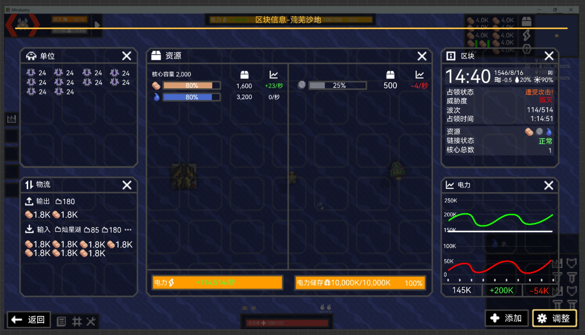

# 区块信息界面
将替代原版的区块统计信息面板  

显示绝大部分区块的信息  
必要包括：  
**基础信息**
- 区块名（非区块显示存档名字）
- 原始区块编号（没有不显示，未改名不显示）
- 最高核心代数 
- 最大储量
- 游戏时间
- 当前波次/敌方核心数目
- 可开采资源
- 威胁度  

**资源**
- 区块每个电力体系的电量和储量
- 每个物品的数目，占比，变化幅度，输入与输出
- 单位数目
### 打开方式
可以由不同方式打开，再次点击即可关闭  
- 点击快捷键 **I**（info）
- 点击资源栏  图标
- cooker行星终端中直接点击区块详情

点击返回或按ESC也可以关闭
### UI界面
#### 模块化

- 界面采用**模块化**的设计  
- 总共平均分为6个模块，每个模块可以向其他模块扩展，并自适应内容  
- 模块扩展不可以出现拐角，只能出现方框
- 不同的模块用较黑的方块包裹，内容显示略微向内收  
- 模块自定义统一到所有存档

模块化之后，可以添加更多区块信息，甚至包括没有什么用的建筑数目统计  
非必要：
- 电力趋势图
- 敌人攻势图  

后续有想法都可以添加！！！

必须有：
- 资源
- 电力
- 单位
- 区块简介
- 物流信息

#### 模块调整

- 点击**调整**后，所有模块都会被灰边包裹，不显示任何信息的模块中间会显示一个加号
- 模块内所有区域都可以拖动该模块进行移动
- 悬停在模块边缘的灰边，灰边变黄高亮，同时鼠标变成对应的移动图标，拖动即可拉伸，这个拉伸不能覆盖已有信息的模块  
   - 拉伸时，会有一条预览黄色虚线跟随鼠标移动  
当移动到距离下一个模块的边缘的1/3时（快要覆盖掉整个模块），新模块内加号渐渐消失（0.5秒），灰边同时变黄，此时松开即可扩展模块并自适应内容，内容的显示效果会淡入淡出  
若向有信息的模块拉伸，原来的黄色边框会变橙黄，以提醒玩家这样不可行
   - 收缩时，会有一条预览黄色虚线跟随鼠标移动  
   当模块快要收缩至下一个模块时，虚线变红，多出来的模块边框也变红包括两模块接壤的地方，此时松手即可收缩并自适应内容，内容的显示效果会淡入淡出  
   若模块处于最小状态，拉伸至模块1/3处，模块边框和虚线变红，松开便删除这个模块的信息，并在中间显示加号
   
- 悬停  不会有什么反应，点击后模块内显示所有可选信息，点击模块外可不选择退出  
悬停对应按键黄框高亮，点击后展示信息  
可以重复选择同一个信息来展示，只是没什么用就是了

#### 各个信息模块
- 资源  

悬停每个图标都会显示对应名称  
    总量：显示目前数目，点击可以改变数字的显示精度：精确数字/省略数字

   变化趋势：显示目前资源变化速度，小于0为红，大于0为绿，0为白  

   外部输入和对外输出：分别显示外部输入和向外输出（包括玩家消耗的）

- 电力  

与[电力栏](电力栏.md)的性质一样

- 单位  
界面可以上下滚动  
显示现在存在于区块内的所有己方单位数目

- 区块物流  
所有物品的物流和接收区块与发送区块  
接收部分可以看到部分发送区块，后面空间不够话，用代表省略  
点击**接收**可向下展开查看所有发送区块，这些区块会直接占用模块内的空间，并会保存下来，关闭该界面也不会消失  
悬浮接收对应数字，会在鼠标旁边显示这个资源来自哪个发送区块  
**发送**同理  
传输速度采用 **个数/分钟**  