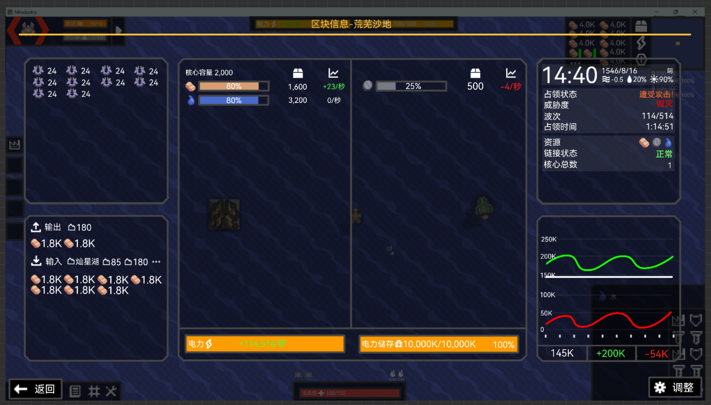

# 区块信息界面
将替代原版的区块统计信息面板  

显示绝大部分区块的信息包括：  
**基础信息**
- 区块名（非区块显示存档名字）
- 原始区块编号（没有不显示，未改名不显示）
- 最高核心代数 
- 最大储量
- 游戏时间
- 当前波次/敌方核心数目
- 可开采资源
- 威胁度  
**资源运输**
- 区块每个电力体系的电量和储量
- 每个物品的数目，占比，变化幅度，输入与输出
- 单位数目
### 打开方式
可以由不同方式打开，再次点击即可关闭  
- 点击快捷键 **I**（info）
- 点击资源栏  图标
- cooker行星终端中直接点击区块详情

点击返回或按ESC关闭
### 界面

