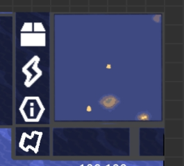

# 小地图显示优化
## 告警位置标注
小地图会直接显示对应告警的图标
## 自适应缩放
- 在玩家闲置状态下，地图会适当放大
- 在玩家准备出击时，地图会缩小
- 若在玩家调控后的30秒内将不会进行自适应  
## 手机端
在大地图中，可以双击一个地方来快速将镜头镜头移动至目标位置，并在双击后退出大地图
  
小地图不再可以打开大地图，点击只会让镜头转移到指定位置  
点击  打开大地图  
左侧的滑块可以拖动缩放小地图大小，右大左小
