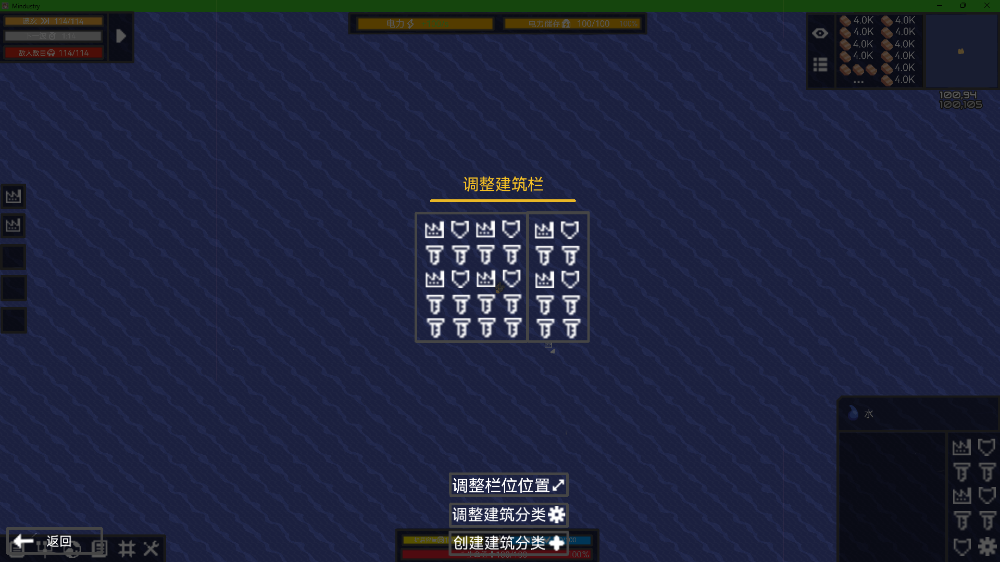

# 建筑选择栏

## 分类选择细化
不仅提供原版的十种分类，有更多实用的分类组合  
- 炮台分类细化：攻击类 辅助类
- 运输分类：运输类包括所有可运输的种类，如液体管道，载荷质量驱动器和导热装置
- 时期分类：分不同时期的分类，适合短时间内用同一时期的不同物品的情况
- 自定义分类：提供自定义的分类，玩家可以自己DIY分类，也能对预设的分类进行DIY
- 自定义选择栏相对大小
- 分类较多时，可以用鼠标滑动分类栏上下移动

## 调整快捷建筑栏

功能栏中，点击  进入**调整建筑栏**界面，按**ESC**或**返回**即可关闭
- 左侧显示未选择显示在快捷建筑栏的建筑分类，右侧显示快捷建筑栏的分类
- 悬停图标，背景高亮
- 拖动可以将图标左右移动，以调整需要显示的建筑分类
- 右键图标可以快速移动图标

### 快捷建筑选择栏调整大小
点击 **调整栏位位置**  界面暂时消失，此时可对建筑选择栏大小进行拖动更改：  
- 鼠标移动至建筑选择栏边缘,鼠标改变样貌（  ），拖动以调整大小  
- 同样，建筑分类的栏位也可以调整大小  

**调整并非绝对自由，而是 *一格一格* 地扩建栏位**
## 建筑栏自定义界面
由于战役的科技并不会直接加入玩家创建的分类，只有在沙盒模式下或全科技下才能打开这个模式  
新研究的科技不会加入玩家DIY的建筑分类，除非本身就带有这个建筑

建筑的自定义通用任何存档  
点击  **调整建筑分类**或**添加建筑分类**以打开该界面，按**返回**或**ESC**不保存返回上一个界面  
若有未保存内容，退出界面时提示是否保存  
界面会0.4s内淡出淡入   

### 分类图标界面
- 左边的源预设分类不能改动，右边的分类为当前存在的建筑分类预设
- 未选中任何分类时，界面中间显示**点击右侧图标以选择需要调整的建筑分类**
- 鼠标悬停在右侧任意分类图标，背景高亮，点击选中并黄框常亮，右侧界面显示这个分类下包含的所有图标，并在下面显示对图标操作的按键
  
- 拖动以更换图标相对位置
- 分类过多时，可滚动鼠标上下翻动
### 对建筑分类进行操作
#### 添加&删除建筑分类包含的建筑种类
以下按键都是悬停高亮黄框
- 无法对**源建筑分类**进行操作
- 左侧显示已经解锁的待选建筑，黄框高亮的建筑代表已选，点击任意建筑能添加或删除图标
- 右侧显示所有已选建筑，右键可删除已选建筑

- 任意边拖动图标可调整建筑分类的相对位置，也可跨越中分线到另一端  
- 点击**全部添加**或**全部移动**即可执行对应操作
- 玩家DIY预设可以双击  **删除**  
双击 **重置** 能重置预设至上次保存的进度若进度相同，按键文字图标会稍淡  
点击 **保存** ，若进度相同，按键文字图标会稍淡
- 点击  并激活高亮黄框，左侧建筑栏将显示所有建筑，点击横线处输入文字进行搜索（参考我的世界的搜索栏）

#### 添加&删除建筑分类
以下按键都是悬停高亮黄框，若进度相同，按键文字会稍淡
- 点击 **创建建筑分类** 以添加新的分类预设，先选择图标后进行添加建筑
- 图标选择采用原版区块标记图标的界面即可
