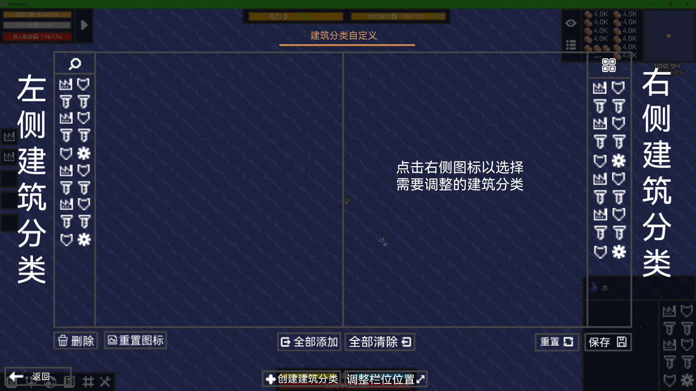

# 建筑选择栏

## 分类选择细化
不仅提供原版的十种分类，有更多实用的分类组合  
- 炮台分类细化：攻击类 辅助类
- 运输分类：运输类包括所有可运输的种类，如液体管道，载荷质量驱动器和导热装置
- 时期分类：分不同时期的分类，适合短时间内用同一时期的不同物品的情况
- 自定义分类：提供自定义的分类，玩家可以自己DIY分类，也能对预设的分类进行DIY
- 自定义选择栏相对大小
- 分类较多时，可以用鼠标滑动分类栏上下移动
## 建筑栏自定义界面
建筑的自定义会跟随存档保存，自定义游戏单独保存  
在设置中或功能栏或按默认快捷键 **O** 打开该界面，点击界面外可保存退出界面  
界面会0.2s内淡出淡入   

### 分类栏界面
- 左边的预设分类不能改动，右边的分类为当前存在的建筑分类预设
- 鼠标悬停在任意分类图标，背景高亮，点击选中并黄框常亮，右击可以调整是否显示该建筑分类，隐藏的建筑不**在建筑选择栏中**显示，降低**在该界面**不透明度（为66%）
- 拖动以更换顺序
- 选中后再次点击，将中间的弹窗更换为显示所有图标的界面，可为选中分类更换图标，点击任意图标切换至对应图标
- 分类过多时，可滚动鼠标上下翻动
### 添加&删除建筑分类
- 点击  以添加新的分类预设，先选择图标后进行添加建筑
- 源预设建筑栏无法删除，但点击  能重置预设
- 玩家DIY预设可以点击  删除
### 添加&删除分类中的建筑
- 左侧显示待选建筑，黄框高亮的建筑代表已选，点击任意建筑能添加或删除图标
- 右侧显示所有已选建筑，右键可删除已选建筑
- 点击  并激活高亮黄框，左侧建筑栏将显示所有建筑，点击横线处输入文字进行搜索

### 建筑选择栏调整大小
点击  激活并高亮黄框，此时可对建筑选择栏大小进行拖动更改：  
- 鼠标移动至建筑选择栏边缘,鼠标改变样貌（  ），拖动以调整大小  
- 同样，建筑分类的栏位也可以调整大小  

**调整并非绝对自由，而是 *一格一格* 地扩建原有栏位**