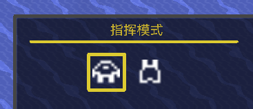
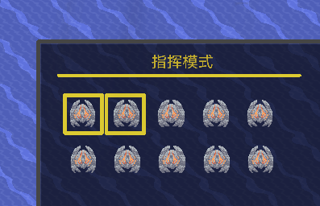

# 指挥模式
拓展一些内容和优化操作逻辑
- 可以选择控制单位或炮台，高亮黄框即为选择，按快捷键**Left Alt**可快速切换  

- 可以对选中的对象进行多选择（就是设置模式里面的多选功能）  
点击即可选择需要操控的单位，选中的单位会高亮黄框（不会像原版那样）  
未选中任何单位的时候就是全体控制  

### 选中炮台时
鼠标会变成  
  （单位自动瞄准的图标，同样会旋转，常态为白色，右键开火后，图标瞬间变白）  
所有炮台都会以鼠标位置为目标，长按右键，所有炮台开火  
中间可锁定目标持续攻击至目标消失
选中框与分类器的一致