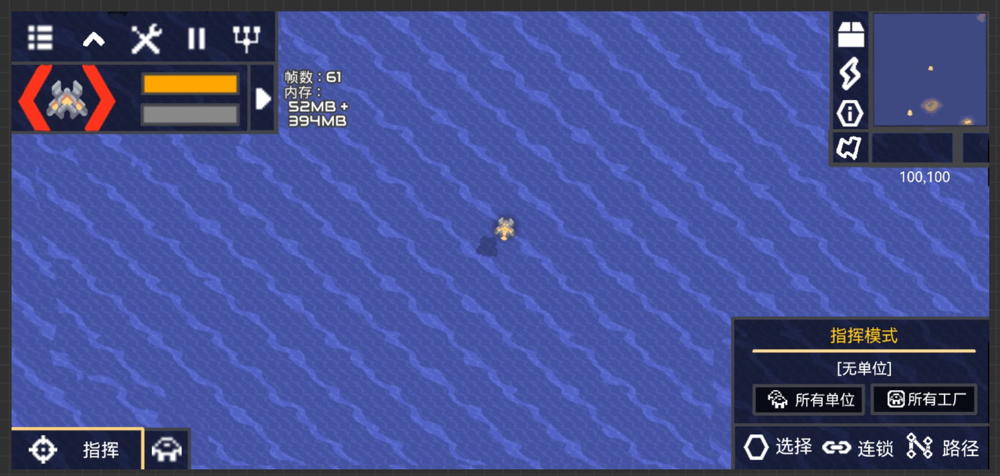
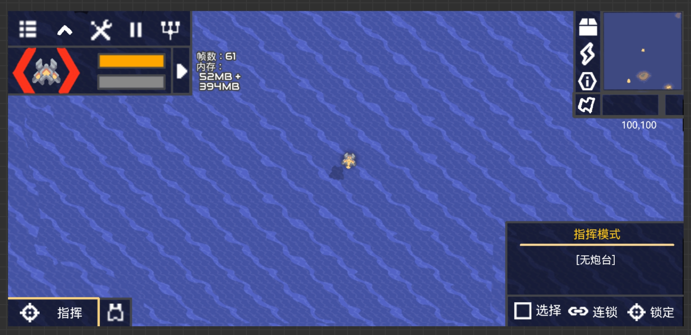
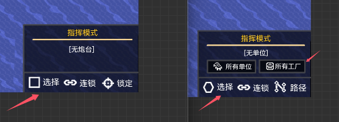
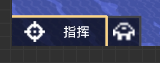
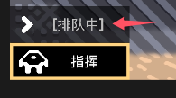

# 指挥模式

拓展一些内容和优化操作逻辑
## pc端
默认为单位模式
### 切换模式
按快捷键**Left Alt**在单位和建筑之间切换，并屏幕的下显示**已切换至指挥单位**<->**已切换至指挥炮台**   
其中，**单位**和**建筑**为橙色字体  
### 选择
新增：   
- 可以对选中的对象进行多选择（就是设置模式里面的多选功能）  
指挥栏里点击对应目标操控的对象，选中的对象会高亮黄框（原版是点击后其他目标全部取消选择）  
未选中任何对象的时候就是全体控制  
右键点击单位图标可以取消选择
### 单位模式
没有什么改动（后续会添加编队UI，这个不急） 
### 炮台模式
因为指挥模式只可能指挥炮台单位，应该叫指挥模式的建筑模式应该叫炮台模式  
选中的炮台会被黄色方框选中，大小与炮台大小一致

- 处于炮台模式下，鼠标会变成  
    
（单位自动瞄准的图标，同样会旋转，常态为红色，右键开火后，图标瞬间橙白色）  
选中的操作逻辑与选中单位一致，双击炮台会选中屏幕中所有相同炮台    
- 右键点击后，选中的炮台会向点击位置转向，长按右键后，转向并开火  
- 中键可锁定目标持续攻击至目标被消灭，如果这个目标跑出了索敌范围，在目标再次进入范围时，会再次锁定攻击  
对着非敌人位置点击中键，取消锁定  
对另一个敌人点击中键，切换锁定目标  
即使锁定目标，长按右键仍然可以朝指定方向开火，停下后继续锁定

## 手机端
指挥单位

指挥炮台  

这些按钮都是手机版特供  
  
逻辑与电脑端大差不差  
### 开启
功能栏中点击   功能栏被隐藏（扩展功能栏不会），功能栏位置变为  
  
点击  **指挥** 关闭指挥模式  
### 切换
代表单位模式，点击后变为  炮台模式

### 选择
- 开启后若没有选择对象， **选择** （  **选择**） 默认打开，且没办法关闭  
若已经选择单位了， **选择** （  **选择**） 默认关闭  
点击选择目标后，选择关闭（只生效一次）  

- 指挥栏中，长按对象图标取消选择（右键）
  
- 点击  **连锁** 进入连锁选择，点击对象后，选中屏幕内所有相同目标，后关闭连锁（仅生效一次）  
若在连锁选择下长按框选，则会选择所有

### 单位模式  
单位模式下，不管是否处于选择状态下，长按都可以选择单位（原版保持不变）
- 点击  **所有单位** 选择所有单位，点击   **所有工厂** 选择所有兵工厂
- 点击  **路径** 后进入连续路径标记，即电脑中键和手机版抽象的 [ **排队中** ]（搞不懂为什么叫这个）  

### 炮台模式   
选择炮台后，  
- 单击后，选中的炮台会向点击位置转向，长按后，转向并开火  
- 点击 **锁定** 进入锁定模式，这时点击等同于电脑端的中键，此时长按仍然可以开火