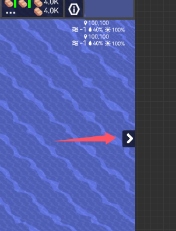
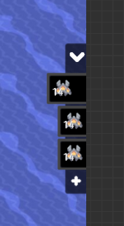
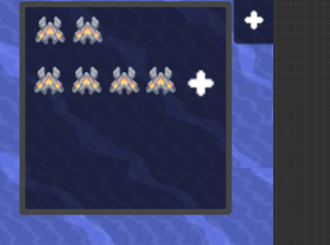
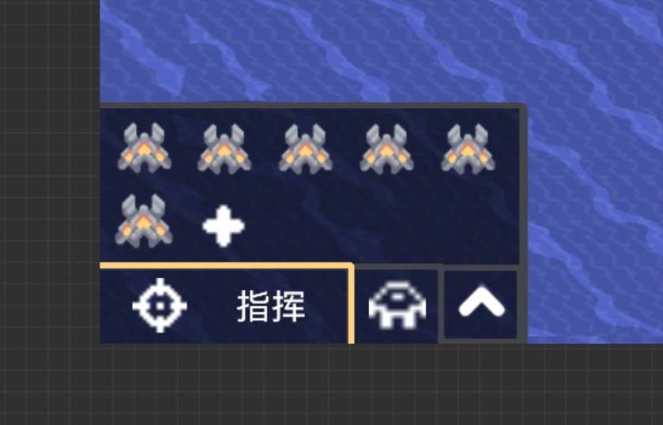

# 指挥模式

拓展一些内容和优化操作逻辑  
在单位模式下，原版的 **R**键 更改建筑朝向 和 快捷栏**1->0** 禁用（编队冲突） 

## pc端

### 切换模式
默认为单位模式
按快捷键**Left Alt**在单位和建筑之间切换，并屏幕的下显示**已切换至指挥单位**<->**已切换至指挥炮台**   
其中，**单位**和**建筑**为橙色字体  
### 选择
新增：   
- 可以对选中的对象进行多选择（就是设置模式里面的多选功能）  
指挥栏里点击对应目标操控的对象，选中的对象会高亮黄框（原版是点击后其他目标全部取消选择）  
未选中任何对象的时候就是全体控制  
右键点击单位图标可以取消选择
### 单位模式(CommandUnit)
没有什么改动（后续会添加编队UI，这个不急） 
### 炮台模式(CommandTurret)
因为指挥模式只可能指挥炮台单位，应该叫指挥模式的建筑模式应该叫炮台模式  
选中的炮台会被黄色方框选中，大小与炮台大小一致

- 处于炮台模式下，鼠标会变成  
    
（单位自动瞄准的图标，同样会旋转，常态为红色，右键开火后，图标瞬间橙白色）  
选中的操作逻辑与选中单位一致，双击炮台会选中屏幕中所有相同炮台    
- 右键点击后，选中的炮台会向点击位置转向，长按右键后，转向并开火  
- 中键可锁定目标持续攻击至目标被消灭，如果这个目标跑出了索敌范围，在目标再次进入范围时，会再次锁定攻击  
对着非敌人位置点击中键，取消锁定  
对另一个敌人点击中键，切换锁定目标  
即使锁定目标，长按右键仍然可以朝指定方向开火，停下后继续锁定

### 编队操作界面(GroupUI)
  
单位和炮台的编队单独存储  
编队操作界面需要在设置中单独打开  
在指挥模式下，在屏幕正右边有一个突出的向右箭头，悬停背景高亮，点击即可展开编队界面（此时箭头向下），注释 **编队**    
整个编队界面 **右侧居中**  

- 界面内，选中单位时，点击  或 **R** 可以将单位添加至编队中，编队图标默认为 生命值上限最高的 再 最多的单位  
未选中单位时，  淡化（66%不透明度），悬停背景高亮   
右键  向左边弹出界面，点击界面外消失，这里罗列队伍中所有单位的图标和玩家添加在此的便捷图标，点击界面内的  ，进入到原版图标选择界面，这里添加额外的便捷图标   
  
上面为所有编队内所有单位图标，下面为玩家添加的便捷图标，界面可以调整大小，默认一行5个图标大小  
- 按照顺序添加编队，添加的编队会被一层像标签的框包围，按照顺序排列，从上至下，依次对应快捷键 **1->0**（可以调整按键），因而编队至多10个，在标签左侧显示编队序号  
- 编队图标（大小为指挥模式下展示的大小）上会显示编队所有单位的数目，在图标下面显示当前编队所有单位的生命值比例，最大生命值按照编队时所有单位的最大生命值计算  
- 悬停标签，标签白框高亮，点击即可选中对应编队，同时标签向外略微弹出，代表选中，点击多个可以多选择，再次点击取消选择  
拖动同样可以选择编队，但是拖动选择不会保留上次选择的编队，这点与原版的选中单位相同  
- 选中任意编队时，  变为   ，点击一次时， 变为 ，在选中编队图标上覆盖一层 闪烁一次消失的橙红色的  ，1秒内再次点击即可删除选中编队，若超过一秒，取消删除操作  
- 拖动编队标签可以调整顺序，效果与逻辑相同，当拖动超过界面一定距离，图标会被标上
闪烁的橙红色的  ，松开即可删除对应编队  

## 手机端
指挥单位

指挥炮台  

这些按钮都是手机版特供  
  
逻辑与电脑端大差不差  
### 开启
功能栏中点击   功能栏被隐藏（扩展功能栏不会），功能栏位置变为  
  
点击  **指挥** 关闭指挥模式  
### 切换
代表单位模式，点击后变为  炮台模式

### 选择
- 开启后若没有选择对象， **选择(SELECT)** （  **选择**） 默认打开，且没办法关闭  
若已经选择单位了， **选择** （  **选择**） 默认关闭  
点击选择目标后，选择关闭（只生效一次）  

- 指挥栏中，长按对象图标取消选择（右键）
  
- 点击  **连锁(LINK)** 进入连锁选择，点击对象后，选中屏幕内所有相同目标，后关闭连锁（仅生效一次）  
若在连锁选择下长按框选，则会选择所有

### 单位模式  
单位模式下，不管是否处于选择状态下，长按都可以选择单位（原版保持不变）
- 点击  **所有单位(AllUnit)** 选择所有单位，点击   **所有工厂(AllFactory)** 选择所有兵工厂
- 点击  **路径** 后进入连续路径标记，即电脑中键和手机版抽象的 [ **排队中** ]（搞不懂为什么叫这个）  

### 炮台模式   
选择炮台后，  
- 单击后，选中的炮台会向点击位置转向，长按后，转向并开火  
- 点击 **锁定** 进入锁定模式，这时点击等同于电脑端的中键，此时长按仍然可以开火

### 编队

点击向下的方向，向上弹出编队操作界面，这里注释编队  
取消规划按钮一样会向上自适应抬升  
- 界面内，选中单位时，点击  可以将单位添加至编队中，编队图标默认为生命值上限最高的单位  
未选中单位时，  淡化（66%不透明度），悬停背景高亮   
长按  进入图标选择界面（与电脑相同），这里罗列队伍中所有单位的图标和玩家添加在此的便捷图标，点击  ，进入到原版图标选择界面，这里添加额外的便捷图标   

- 一行至多放置5个编队图标，超过向上自适应扩展  
编队数量上限10个
- 点击即可选中对应编队，点击其他编队切换控制编队  
进阶：若想多选，可以双击选择，双击会保留上次选择的编队，点击终止多选并选中点击到的编队  
- 选中任意编队时，  变为   ，点击一次时， 变为 ，在选中编队图标上覆盖一层 闪烁一次消失的橙红色的  ，1秒内再次点击即可删除选中编队，若超过一秒，取消删除操作    
进阶：长按编队图标即可删除编对应编队   

