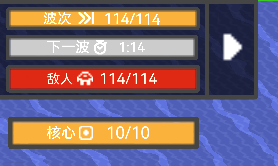

# 波次栏
将原版的波次条更改为一个更加直观的条条，也都是原版样式  
通常显示：  
防守模式下
- 剩余波次，橙色，进度条为涨势
- 下一次波次时间  ，银白色（80%的白色），进度条为涨势  
若没有下一次波次倒计时，显示**游戏时间**

- 剩余敌人数目  ，红色，进度条为敌人总数占比

进攻模式下
- 剩余核心数  ，橙色，进度条为核心占比
关卡逻辑显示在核心条下方

大小自适应  
原版的显示fps，内存等数据显示改到波次栏下方  
