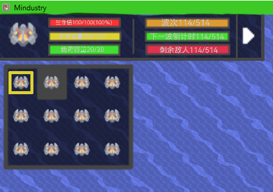

# 自身状态栏
移除原版的围绕在操控单位图标附近的血条，改为更多显示直观数据的条条，这些条都是原版样式，如果条条不够，就自适应居中显示。
通常显示：
- 生命值，具体数值和百分比
- 护盾容量，具体数值
- 载荷容量，具体数值

单位目前的效果于原版相同，显示在UI的下面，跳波因不受影响而在防守模式下常显  
### 初始单位种类切换
悬停单位图标，图标背景高亮,鼠标旁显示wiki，点击向下弹出界面，再次点击或点击界面外区域关闭  
界面覆盖效果栏和告警栏，显示所有可用单位种类，分不同种类  
界面内，框高亮代表黄已选中悬停高亮黄框，悬停单位图标背景高亮并在鼠标旁显示单位名称，单击即可重生并切换单位  
界面分为三层，容纳不同种类的单位，根据核心的种类提供的单位种类数自适应界面大小
# 波次栏
将原版的波次条更改为一个更加直观的条条，也都是原版样式  
通常显示：  
防守模式下
- 下一次波次时间，银白色（80%的白色），进度条为涨势，即打完波次的进度
- 剩余波次，橙色，进度条为涨势
- 剩余敌人数目，红色，进度条为敌人总数占比

进攻模式下
- 剩余核心数，橙色，进度条为核心占比

