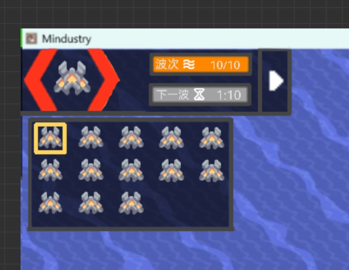

# 自身状态栏
移除原版的围绕在操控单位图标附近的血条，改为更多显示直观数据的条，这些条都是原版样式
通常显示：
### 单位
- 生命值，具体数值及上限和百分比，红色
- 护盾容量，具体数值，黄色
- 载荷容量，具体数值，绿色
- 电离能量（新内容）：具体数值及上限，蓝色  
- 弹药数量：具体数值及种类
### 建筑
- 生命值，具体数值及上限和百分比，红色

- 弹药数量：具体数值及种类
- 装填进度：百分比
## 核心机种类切换
- 悬停单位图标，图标背景高亮，鼠标旁显示wiki，点击向下弹出界面，再次点击或点击界面外区域关闭  
- 界面覆盖效果栏和告警栏，显示所有可用单位种类，分不同种类  
- 界面内，框高亮代表黄已选中悬停高亮黄框，悬停单位图标背景高亮并在鼠标旁显示单位名称，单击即可重生并切换单位  
- 界面分为三层，容纳不同种类的单位，根据核心提供的核心机种类数自适应界面大小
## 携带载荷与效果
携带载荷会显示在右侧，并依次向右边排列，到中心后向上拓宽一格  
效果同理  

