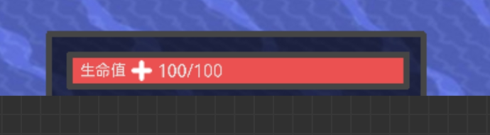

## 自身状态栏
### 核心机种类切换
- 悬停单位图标，图标背景高亮，鼠标旁显示单位，点击向下弹出界面，再次点击或点击界面外区域关闭  
- 界面会覆盖告警栏（在告警栏之上），显示所有可用单位种类，图标大小为默认的一半，分不同种类  
- 界面内，框高亮代表黄已选中悬停高亮黄框，悬停单位图标背景高亮并在鼠标旁显示单位名称，单击即可重生并切换单位  
- 来自其他mod的核心机，会出现在新的一栏
不对其他mod提供等级划分，有什么核心对应，就出现什么核心机  

UI大小默认

### 精细信息显示
在单位有其他数据时，会用其他数据替代右侧的血条，第三个数据会在右侧血条再次创建一条，此后依次类推  
  
**在附身时**，会显示直观数据的条，条的数据显示与[信息栏](信息栏.md)的标准一致，大小与信息栏一致    
生命值总是显示在右下角  
根据显示信息的不同，自适应条的数目  
  
  

至多显示4条  

通常显示： 
#### 单位
- 生命值，具体数值及上限和百分比，红色
- 护盾容量，具体数值，黄色
- 载荷容量，具体数值，绿色
- 电离能量（新内容）：具体数值及上限，蓝色  
- 弹药数量：具体数值及种类
#### 建筑
- 生命值，具体数值及上限和百分比，红色
- 弹药数量：具体数值及种类
- 电力：百分比

#### 携带载荷与效果
携带载荷会显示在左侧，并依次向右边排列，到中心后向上拓宽一格  
效果同理在右侧  
图标大小默认  

#### 正下方信息
原版会显示在正下方的信息，会覆盖状态条显示

## 波次栏
将原版的波次更改为一个更加直观的条条，也都是原版样式和大小，但是长度为原版波次显示那一个框的默认长度  
通常显示：  
防守模式下
- 剩余波次，橙色，进度条为涨势  
若波次为无限，则仅显示当前波次
- 下一波（次时间）  ，银白色（75%的白色），进度条为涨势  
若没有下一次波次倒计时，显示**游戏时间**

进攻模式下
- 剩余核心数  ，橙色，进度条为核心占比  
### 波次栏扩展
  
点击任意条，可以向下展开拓展并常显，再点击关闭  
点击条激活高亮，并显示在上面，这项设置保存至存档  
没有的信息会不显示在上面  
额外可选项：  
- 敌人数目  ，红色，数据和总数，进度条为敌人总数占比，在无波次进攻图不显示
- 敌人生命  ，红色，没有数据，进度条为每一波次生命值占比，计算逻辑与[Boss血条](血条.md)一样，也是每一波刷新，在高难度不显示

后续有想法可以添加

若条的空间不够，会自动向下自适应

要注意的是，这些是替代原版波次或者进攻核心时显示的文本，关卡逻辑的显示优先级高于这些  
即使有关卡逻辑，点击仍然可以打开这个扩展，仍然会高亮之前选择的条

# 手机端

核心机种类：切换点击核心机图标重生（原版不变），长按弹出切换界面，这个界面会叠在电力条和告警上面  
波次栏：长按弹出界面，其他一致  
