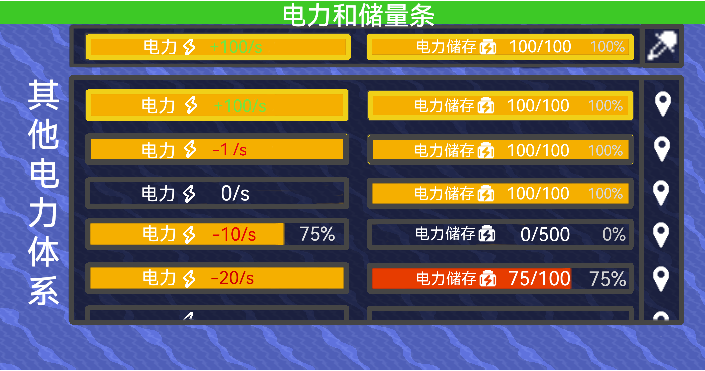

# 电力条
### 大局界面
- 显示某个电力体系的电力和储量，电力条在左边，显示储量条在右边，都为原版样式
- 默认显示整个区块**电力**最高的电力体系，若不存在显示为0即可  
- **电力条**数字显示目前电力和效率，效率采用整数百分比，且百分比数字稍淡  
当电力低于0，数字部分变红  
当电力高于0，数字变绿  
当电力为0，数字为白
- **储量条**数字显示目前的储量和占比，百分比保留一位小数，颜色稍淡  
当电力消耗超过储存的2%，储量条会变红，并发出告警
- 悬停在任意条上会黄框高亮两条，点击后激活常亮黄框并向上弹出界面，再次点击消失
### 其他体系界面
- 弹出的界面保持常显（即使点击界面以外也不会使这个界面消失），这个界面显示当前区块所有的电力体系的储量和电力，不会显示电力节点过少（少于8个）且没有任何电力和储存的电力体系
- 选中的电力体系会在界面中高亮黄框
- 悬停在任意电力体系高亮黄框，代表预选。点击将切换至对应电力体系并关闭该界面，右击会定位到距离自己最近的有关的电力节点且不会关闭该界面
- 有时候电力体系过多，默认至多显示3个电力体系，鼠标在界面内时，可以滑动查看其他电力体系
- 玩家可以自己调整界面的相对大小，将鼠标悬停在上界面边缘，上下拖动以调整  

