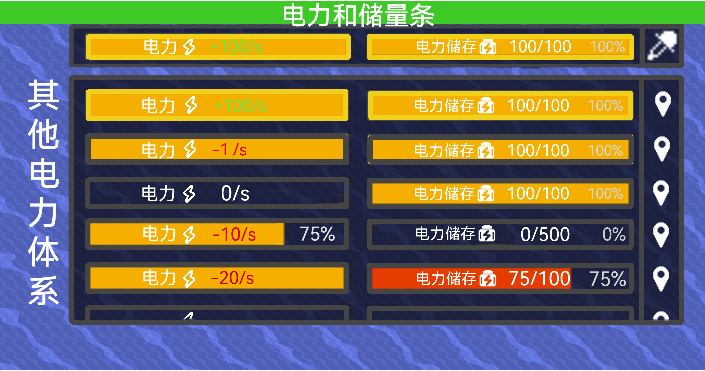

# 电力条(PowerBar)
### 大局界面
- 显示某个电力体系的电力和储量，电力条在左边，显示储量条在右边，都为原版样式，且大小信息栏默认
- 未主动设置**电力体系**时，默认显示整个区块**电力消耗量最高且有电力**的电力体系，若不存在电力体系显示为0即可  

- **数据显示与[信息栏](信息栏.md)不同**
  - **电力条**（原版）数字显示目前电力和效率  
当电力低于0，数字部分变红  
当电力高于0，数字变绿  
当电力为0，数字为白  
在某个状态的时间超过0.5s后，颜色变化才会开始渐变，渐变持续0.5s（防止颜色蹦迪）  
效率采用整数百分比，且数字稍淡。仅会在低于100%时显示，当变为100%时，效率百分比会淡去
  - **储量条**数字显示目前的储量和占比，整数百分比，颜色稍淡，且滞后在末尾  
当电力消耗超过储存的2%，储量条会红黄闪烁（核心受攻击文字的效果），并发出告警
- 悬停在任意条上会黄框高亮两条，点击后激活常亮黄框并向下弹出界面，再次点击关闭
### 其他体系界面（电力条拓展）

- 弹出的界面保持常显（即使点击界面以外也不会使这个界面消失），这个界面显示当前区块所有的电力体系的储量和电力，不会显示电力节点过少（少于12个）且没有任何电力和储存的电力体系
- 电力体系排序根据，电力消耗量（前提是要有电力基础），电力，储量等来决定，具体优先级：  
电力消耗量>电力>储量  
排序每2分钟仅更新一次（避免电力波动导致电力条蹦迪）  
- 选中显示在上面的电力体系会在界面中高亮黄框并在界面中**置顶**（收藏）
- 悬停在任意电力体系高亮黄框，代表预选。  
点击将切换至对应电力体系并关闭该界面  
悬停高亮黄框，点击会定位到最近的电力节点  
拓展（高级）操作：  
右击**电力条**会定位到距离自己最近的有关的电力节点且不会关闭该界面，右击**储量条**会定位到最近的电池  
这个操作对未打开其他电力体系界面也有效  
- 在**其他体系界面**才会显示 ，悬停高亮黄框，点击后黄框常亮并激活**快速寻找电力体系模式**，**暂时**关闭其他体系界面，鼠标会变成  ，点击任意位置后关闭该模式并返回至其他体系界面  
在这个模式下，悬停任意电力节点或电池， 会变亮，点击后**展示**切换为对应的电力体系  
若在该界面点击过除这两个界面外的其他地方   和    都会消失，再点击界面内会再次显示  
- 鼠标在界面内时，可以滑动查看其他电力体系  
玩家可以自己调整界面的相对大小，默认 **自适应显示** 最多3个电力体系，将鼠标悬停在下界面边缘，上下拖动以调整，至多9个  

参考图的数字没有描边不够清晰  

# 手机端
操作逻辑不变  
  
显示电力条默认显示在状态栏下方，效果和载荷图标会显示在下方  
告警栏会移动到资源栏右边并向右对齐，一行7个
在设置里面可以调整显示在屏幕正上方（平板默认）

# 暂停
暂停会使整个电力条往下适应性移动