# 科技树优化
科技与狠活树（）   
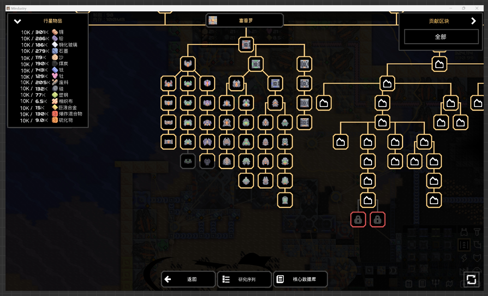
## 科技树分类（内容实装后）
科技树主要分为两类：**分类科技树** 和 **流程科技树**  
- 分类科技树就是原版的那种类型
- 流程科技树就是按照流程来设计的科技树
点击右下角的  即可切换，大小与**返回**同高

## 研究科技界面优化  
### 自动点科技逻辑
利用区块溢出的资源点科技  
按照排列顺序，资源优先给排在前面的科技
### 小细节
已经研究到途中的科技，会在用黄框部分框中它，代表研究百分比  
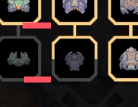  
  
### 新的研究界面  
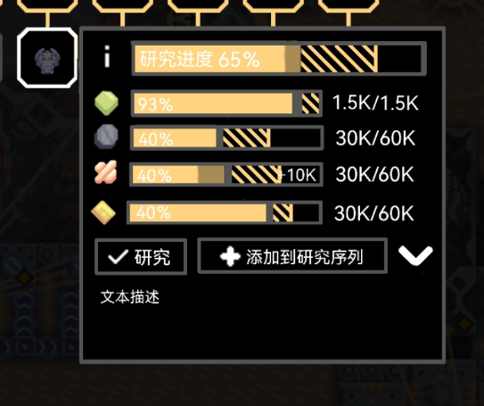  

悬停**已研究**对象时，显示原版的框  
悬停**未研究**科技时，显示新的研究框  
双击直接用所有资源研究科技
鼠标移动至框中可以进行下一步操作，移出，点击研究对象可以使框常显  

- 界面显示当前的研究进度和各个资源材料需求量，以及他们的条    
- 两种条都显示预计可以到达的位置，中间填充建造建筑时的全息光的效果（同样会动）  

- 研究条大小约为研究对象框的一半，样式为图示的样子  
- 资源条大小比研究条的2/3  
条右边的就是原版 **可投入资源总量/仍需投入量**，数字的 显示规则和颜色 与 原版一致   
资源条有可以拖动的滑块，拖动可以调整投入资源的量，同时数据也会随之变化，条的末尾会显示预投入的资源量（+10K） ，预研究部分会被淡黄色（66%不透明度）的部分覆盖   
超过预计进度时，整个条（包括预研究部分）和数据变红，松开会讲滑块移动至预计位置
若没有调整任何资源条，点击  **研究** 可以直接投入所有资源  
- 悬停某个资源会在资源上方显示  
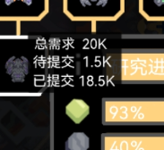  
背景为80%不透明度的纯黑
- 点击  **添加到研究序列** 可以标记  研究对象，添加至研究系列，按钮变成  **从研究序列移除**   

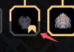

- 文本描述可以点击 向下的箭头 关闭，箭头然后朝右，默认是打开的，保存调整   
- 点击  即可跳转至相关信息

## 选择贡献资源的区块
- (快捷选择) 点击 **全部（当前状态）** 会向下弹出窗口  
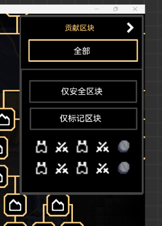  
点击 **仅标记区块** ，会快捷选中所有被玩家上标签的区块  
点击下面的图标可以快捷选中所有对应标记的区块，并黄框标记  
若选择图标会在上面的框中显示图标，填满后再最后显示  
- 点击箭头，箭头转向下，并打开所有区块管理  
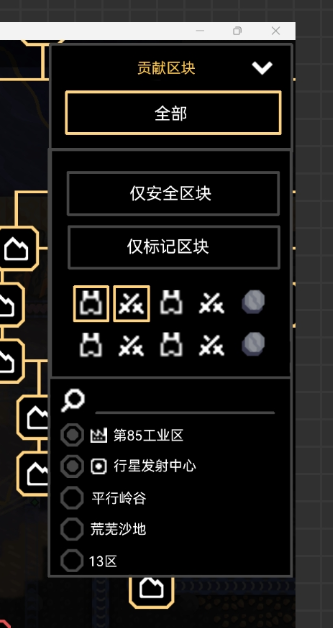  
这里对区块进行具体的选择  
如果选择了具体区块，在 **全部** 处，显示 

- 行星物品添加数据改为 **贡献区块资源总数/资源总数**  
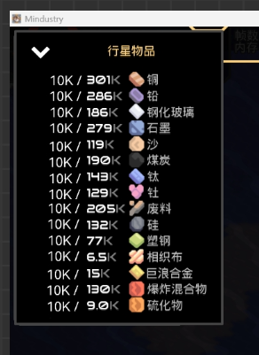

## 研究序列（自动点科技）
点击  ，下面向上弹出一道窗口，高度约为**返回**按键高度的4倍  
未添加任何科技  
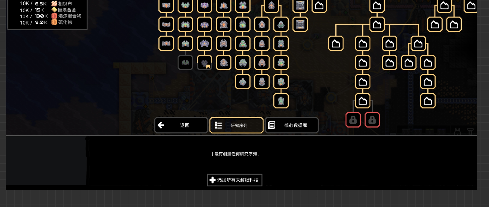  
添加后  
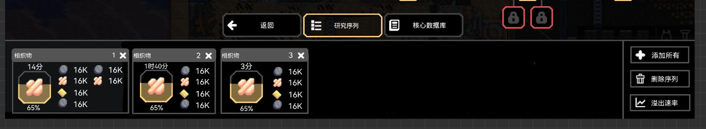  
- 资源显示的是 **仍需投入量**  
对象上方是预计时间  
- 界面内拖动即可调整顺序（与编辑逻辑界面相同）
- 点击  **溢出速率** 向上弹出界面，显示所有区块溢出资源的速率，这个界面会遮挡 **贡献区块**  
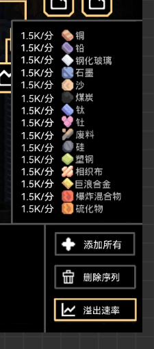

