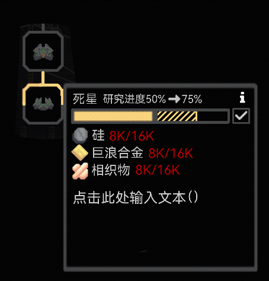
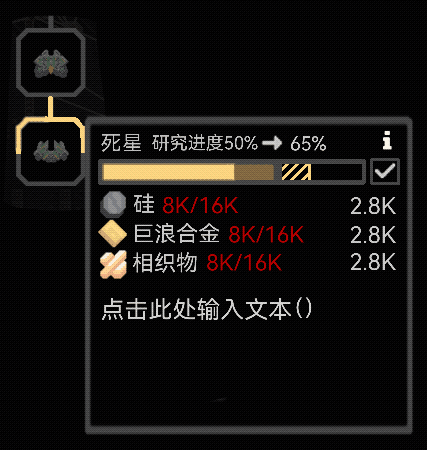

# 科技树优化（要再改）
## 科技树分类
科技树主要分为两类：**分类科技树**和**流程科技树**  
- 分类科技树就是原版的那种类型
- 流程科技树就是按照流程来设计的科技树
## 自定义研究科技
- 优化科技树的操作逻辑
- 研究科技不再是花费所有区块的资源，而是可以指定消耗资源的数量和区块，默认不消耗正在被攻击的区块的资源  
## 研究数量概率（实装内容后再添加）

## UI
大致界面  

### 行星物品窗口
多出了一个数据，用于统计贡献区块的资源总量
### 贡献区块窗口
操作逻辑类似于在行星地图上查找区块的窗口  
前面的圈选中代表可以贡献资源来点科技  
辅助选择可以快捷选择一些区块，有 **全选**/**全不选**/**仅安全(区块)**/**某图标（玩家给区块标记的图标，仅显示存在的图标）**/**...**
### 选择不同的科技树类型
点击最上方图标弹出界面即可更换
### 研究窗口（点科技窗口）
- 研究对象会被不全的黄框包裹，从上至下（或从下至上），代表现在的研究进度  
- 鼠标悬浮在研究对象上会弹出研究界面，移动鼠标至弹窗上使弹窗常驻
- 鼠标点击研究对象图标会直接用所有可贡献资源点科技（原版）   
- 界面会显示一些原版就有的信息和一条研究进度条  
**进度条**就是原版自带的样式，条内黄色填充代表已研究部分，反之 。进度条仅能选整数百分比，展示部分也只是整数百分比  
不再是 **需求/储量** 而是 **需求/所有贡献区块储量**（8K/16K部分）

---
在没有进行任何操作的情况下，进度和条条都会显示**预计可研究程度**，即图中闪烁的部分（要达到的效果）  

---

鼠标点击拖动滑块或点击未研究部分，可以移动滑块，物品消耗数量会同时更新  
- 在未超过预计部分时，要研究的部分会有浅黄色（66%不透明度）填充，且75%会被替换成当前要研究到的部分
- 若超过预计部分，原来浅黄色部分被替换成浅红色，同时预计百分比和预计消耗物品也会变红，松开鼠标后，

  
最后点击√进行研究

## 多人查看科技树
- 在多人战役下，所有玩家都可以打开当前的科技树，在拥有管理员权限的玩家可以点科技，没有管理员的玩家双击对应科技可以在科技树中标记，再次双击取消标记
- 一个玩家仅能标记一个科技，所有玩家都可以看见高亮方框的科技
- 鼠标悬停，额外在弹窗中描述文本下方显示**推荐该科技玩家**的名称，至多显示6个，顺序为**先到先得**