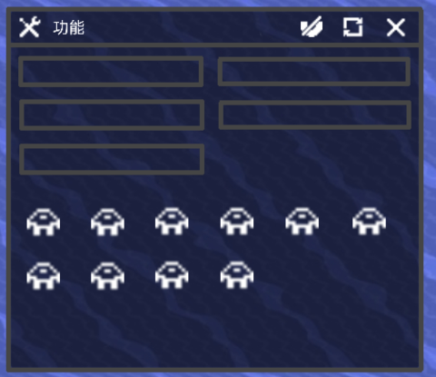
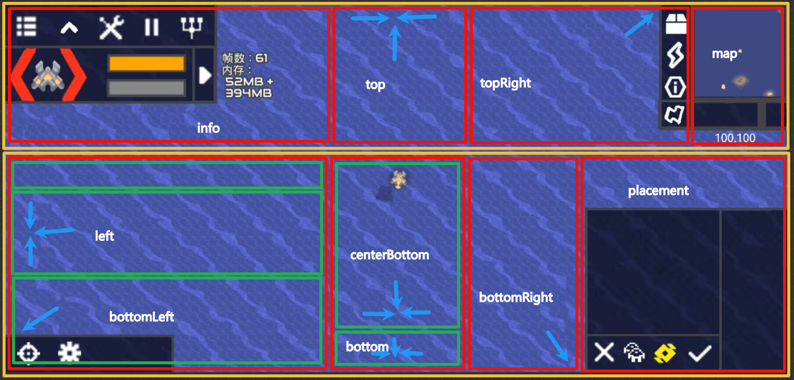
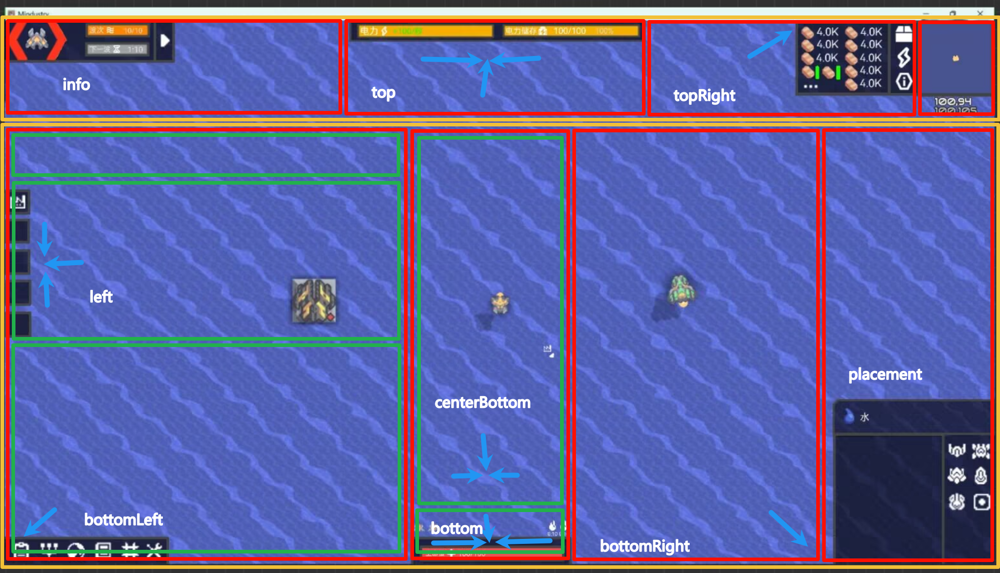

# UI层级
适配更多功能  
UI的界面大致分为：固定层（如建筑栏），弹窗层（如资源栏），窗口层（如功能栏），窗口弹窗层（如功能栏中的功能多选）  
这几个从左往右为底层到顶层的分布  
## 窗口
  
窗口可以借鉴Windows的设计，何种功能应用窗口会单独说明  
在窗口左上方，显示当前窗口的功能图标和它的名字，双击图标可以将窗口缩小成一个悬浮球，点击即可再次展开，悬浮球可以拖动    
右对齐的图标，全都是操作窗口的图标，悬停时，图标背景高亮，并在鼠标旁显示操作名称，点击执行操作  
开启窗口一段时间（3s）后，上边窗口操作区域淡出消失，再次点击或移动到区域内会再显示

1. 自由调整窗口位置和大小  
拖动窗口顶部以拖动窗口  
窗口边缘停滞约0.5秒，鼠标变成 （原版），此时拖动即可调整窗口大小，部分窗口会记住调整的位置和大小  
窗口大小最小不能小过所有控制窗口功能按钮的大小，最大不能超过全屏大小，窗口上部不能移动超过屏幕最上方  
按下  ，重置位置和大小  

2. 自适应内容  
空间不够展示时，可以向下延伸，在窗口里拖动或滚动滚轮查看下面的内容(参考win文件管理器)
内容自适应主要有两种要素：
- 图标（按钮）：按照从左往右的顺序依次排列，图标大小不会随着窗口大小变化，所有图标向左对齐，第一行行的第一个图标位置固定，接下来的每个图标的位置平均分配，直到空余出来的位置超过图标大小，此时再填入新的图标，反之  
下面的每行会根据第一行的位置对齐内容，行间距固定  
- 条：自适应规则在图标的基础上，条的高度为默认高度，长度会随着窗口大小自适应，长度最短为默认长度的一半，最长为默认长度  

3. 关键位置吸附  
吸附默认为关闭状态，点击  后变为  ，开启 **自动吸附**  
这里参考UI对齐分布图

每一个固定层UI的边界和红色框为关键位置，窗口边界移动到这里会自动吸附  
在固定层吸附后，窗口的图层变为固定层   
