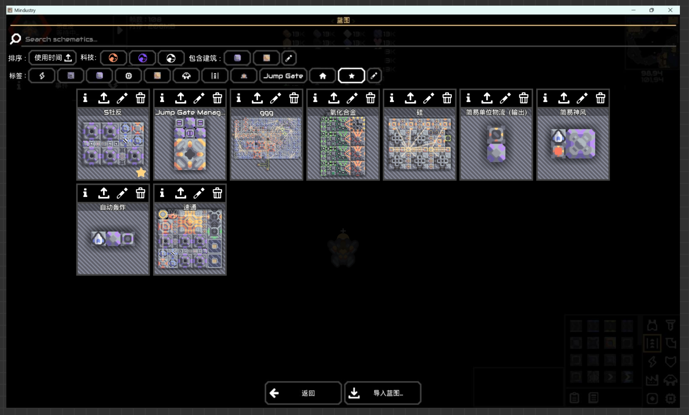
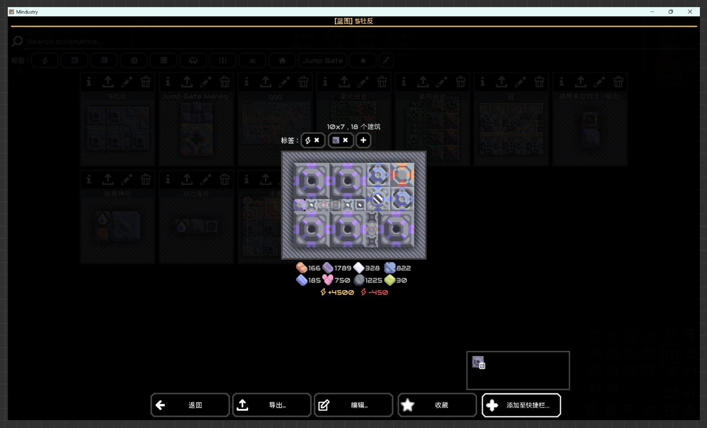
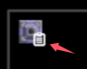
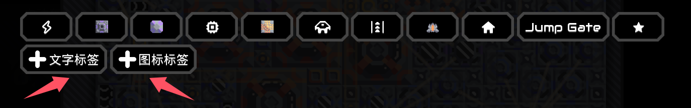
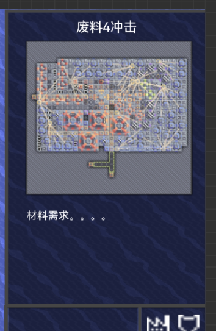

# 蓝图界面
堆砌成山的蓝图，工业基建的荼毒  
这里的改动很简单，就不弄太多UI示意了
### 主界面

- 排序方式：使用时间，使用频次，名字，默认（递增 递减）  
- 不同科技分类，进入星球自动选择对应的科技，可以多选，显示使用选中科技的蓝图  
- 直接通过建筑寻找，寻找所有有关建筑的蓝图，点击  进入原版的图标选择界面，但是只能选择建筑，逻辑和下面的 **标签** 一致   
- 当前如果没有建造条件的蓝图，蓝图稍淡（66%）  
- 悬停蓝图时，会在蓝图边上显示各个物资的 **储量/需求**，共两行，80%不透明度纯黑
- 收藏蓝图会在蓝图右下角显示有一个黄色的 
### 蓝图详情
- 点击  后，进入蓝图详情界面，界面也就添加两个按钮，  **收藏** ，  **添加至快捷栏**    
 
- **收藏**点击后变为**取消收藏**，收藏蓝图  
在蓝图主界面里会呈现到最前面，但也会受到分类的筛选  
**快捷收藏**：在蓝图主界面，按住 **Left Alt** ，鼠标变为  ，点击蓝图即可收藏

- **添加至快捷栏**点击后，在上面弹出窗口，也就是原来的快捷栏，点击对应位置即可将蓝图填充上去，但在填充前需要玩家选择 **蓝图在快捷栏呈现** 的图标    
**选择图标**：选择位置后，进入选择图标的界面（原版的），这里只会显示蓝图的标签和   **其他标签**
，点击**其他标签**后进入原版选择图标界面  
若蓝图图标选择了一个建筑或单位的图标，则在右下角加一个  ，代表这个是蓝图  
  
下面的两个按钮不显示  
  
**快捷添加至快捷栏**：悬停蓝图时，点击快捷栏号，直接添加，再次点击可以删除，默认使用蓝图的第一个标签，若没有才会进入选择图标界面  

### 联动快捷栏
- 鼠标悬停在快捷栏的对应图标上，在信息栏上显示该蓝图的名称和简图及其材料需求  

- 同时，点击蓝图选择后，这个界面仍然显示，放置蓝图后消失