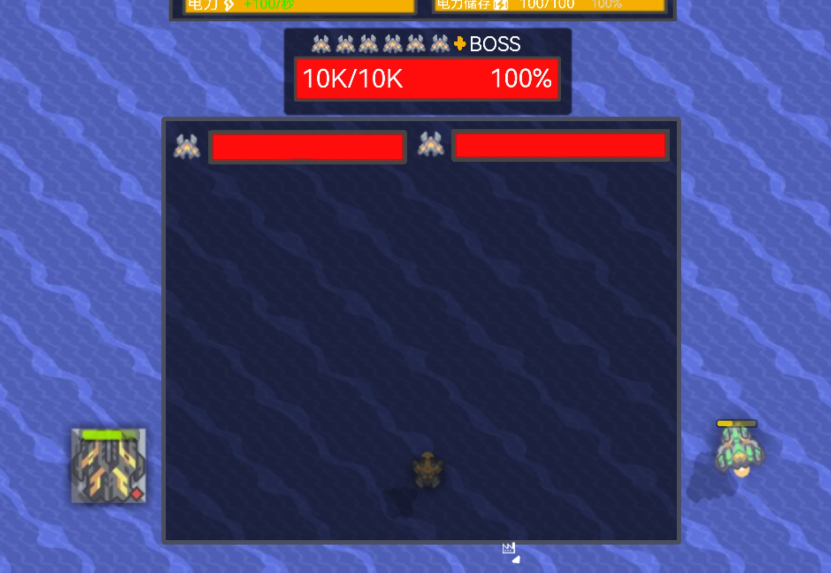

# 血条 
## Boss专有血条
主要是对原版boss血条的更改  
原版的boss血条跟没有是差不多的，boss血条统计了场上存活的所有boss的生命上限的和与当前boss的生命值的和，然后显示为百分比，但是这样会导致前一个boss死亡后，boss血条会突然上升，甚至上升至满，几乎提供不了任何信息，多数是看到boss血条在蹦迪  
boss血条进行了以下更改：  
1. boss血条显示当前boss的图标，具体生命值与上限的总和，百分比  
按照生命值上限，从大到小依次从左往右排列，直到第七个加号  
死亡的单位，图标会变成灰色并在短时间内向下移动消失，将它摆放至最后一位  
死亡单位图标也按照生命值顺序排列  
2. 血条的计算规则有所更改：每一波会重新采取一次场上所有boss的生命上限总和，而不是之前的时时刻刻采取的生命上限总和，这样不会导致前一个boss死亡后，boss血条突然上升  
死亡单位图标会在下一波完全消失  
3. 血条可以点击展开并高亮黄框，界面可以查看每一位boss的具体生命值，界面默认居中，默认大小能容纳8个boss，界面内可以滚动，横向纵向都可以调整大小，调整纵向会左右平均扩大，调整的大小保存于所有存档，在设置中可以恢复默认  
扩展血条在默认大小界面下，大小于信息栏一致，调整后，血条高度不变，宽度最低为原来的一半，最大就是默认值，每一列的血条数量随界面大小自适应  

## 常态血条
### 血条显示规则  
常态血条由三个图层组成：  
底层为不透明度33%的纯黑，中层为33%的颜色，顶层为80%的颜色  
中层和顶层颜色由当前血量决定，整体就是从纯绿到纯红的均匀变化 

血条居中置顶，大小由对象大小决定，高为对象大小的1/6，长度为5/6

显示规则：
- 血量高于95%状态下不显示血条，  
- 可以调整显示生命值的最低阈值和显示血条的单位建筑类型  
默认：生命上限高于100，仅炮台墙体等防御建筑和所有单位  
- boss不显示常态血条  
- 非pvp中，对于敌方，只有在低难度下会显示血条，高难度下不会显示血条  
pvp中，血条会根据队伍颜色显示，且血条颜色不会随血量变化而变化，规则中可以开关闭血条是否显示其他队伍的血条  
