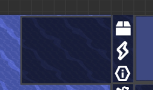

# 资源显示栏
悬停 （原版）黄框，点击即可开关闭资源栏
- 资源栏更改为从上自下显示物品，默认显示所有物品及其数量  
- 未显示的部分会在最后显示   

  

### 自由拉伸显示区域
- 鼠标悬停在左侧边缘，一小段时间后（大约1秒）鼠标变为  即可拖动边缘增多显示内容，自适应内容  
- 当物品种类增加至无法再显示时，会自动往外扩增一层  

### 电力条开关
悬停 （原版） 黄框，点击即可开关电力条  
（彩蛋？）若电力条处于关闭状态，在电力处于负的状态时，会红温并震动  
### 细化信息显示
- 鼠标悬停在数字上时，会在鼠标旁显示精确的数量和百分比（一位小数，稍淡）
  当数量涨到95%时，数目会变橙色（状态指示灯的颜色），降到90%时变回白色  
  在数字下面显示目前的涨落速度，同样  
速度低于0，速度显示为红色  
速度高于0，速度为绿色  
为0，速度为白  
- 当减少速度超过总量的1%时，数量数字会渐变红温，会覆盖橙色
### 调整 资源可视化 方式（进阶功能，待设计）
右键  后，打开调整面板，玩家的调整会保存至存档  

### 打开区块信息界面
点击   即可打开，由66%透明度的界面覆盖，鼠标在未移动的时候再次点击原来  的位置可关闭，按ESC或点击右下角按钮可关闭该界面
#### [UI界面单独说明](区块信息界面.md)

# 手机端
