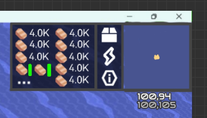

# 资源显示栏
- 资源栏更改为从上自下显示物品，默认显示所有物品及其数量  
- 未显示的部分会在最后显示   

  
  
### 自由拉伸显示区域
- 鼠标悬停在左侧边缘，一小段时间后鼠标变为  即可拖动边缘增多显示内容

### 细化信息显示
- 鼠标悬停在数字上时，会在鼠标旁显示精确的数量和百分比（一位小数，稍淡）
- 当数量超过95%时，数目会变橙色（状态指示灯的颜色）
- 在数字下面显示目前的涨落速度，同样  
速度低于0，速度显示为红色  
速度高于0，速度为绿色  
为0，速度为白  
- 当减少速度超过总量的1%时，数量数字会渐变红温
### 资源储量可视化方式
- 悬停在眼睛图标上一小段时间会显示wiki，默认状态为白色的 
- 点击图标可在  与  之间切换，右击激活眼睛，眼睛变黄  
- 眼睛被激活时，所有**已解锁**资源都会显示并将资源显示栏拉到最大。点击会让对应资源在**显示数量**和**不显示数量**之间切换，右击会让资源在**显示**和**不显示**间切换  
处于**不显示**的物品只能在眼睛被激活的情况下，看见不透明度为66%的贴图与数字
- 眼睛未激活时  
：显示被隐藏数值的资源，反之
- 处于**不显示数量**的资源，在数量低于10%时，会开始缓慢闪烁，越少闪烁越频繁，频繁程度调整至一个较为舒适的程度
### 打开区块信息界面
点击  或按快捷键 **I** (info) 即可打开，由66%透明度的界面覆盖并将其他所有UI关闭，鼠标在未移动的时候再次点击原来  的位置可关闭，按ESC或点击右下角按钮可关闭该界面
#### UI界面单独说明，在[区块信息界面](区块信息界面.md)