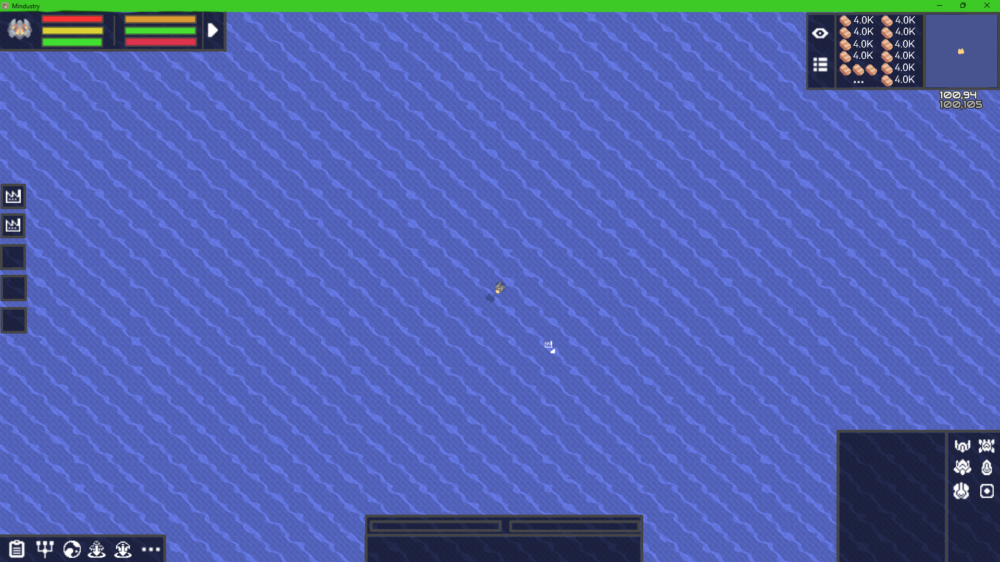
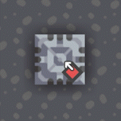

## 单位生成和删除 

## 启用建筑栏的单位模式
能像放置建筑一样放置单位，操作方便直观  
- 按快捷键**Left Alt**或在功能栏点击  激活弹窗，仅可再次按快捷键**Left Alt**或点击  关闭该模式
- 界面会直接占用原版的建筑选择栏，用于选择生成单位
- **Left Alt**将作为一个通用的按键，作用于[指挥模式](../../显示优化/重构原版UI/指挥栏.md)和[设置模式](../../../../#已完成项目优化&添加/设置模式扩展-单位.md)  
在这两个模式启用的情况下，按**Left Alt**无法启用单位生成模式  
在单位生成模式下，同样可以打开指挥模式和设置模式
### 生成单位
与选择建筑一样，在栏位里面选择生成的单位，左键选择，右键取消选择  
单位信息仅显示名称即可  
同样的，单位也分为不同种类：步行  ，空军  ，爬行（机甲），海军  ，坦克  ，其他  等（后续添加）
- 选择单位后，在鼠标下方显示单位同样大小的预生成贴图，参考  
  
- 在区块任意地方，单击左键即可在对应区域生成一个单位（在墙内也可，只是部分单位会死亡）
- 长按左键0.5秒后，可快速生成单位，逐渐加快生成速度，3s后每秒生成8个
- 长按左键再按住**Left shift**（顺序不能反，这个模式下仍然能打开指挥模式），即可在对应位置快速生成单位，每秒生成8个  
若期间松开**Left shift**，会停止生成单位（即使仍然按住左键）再次按**Left shift**可继续生成。松开左键同理  
#### 生成动画为原版世界处理器生成单位的动画  

### 删除单位
与拆除建筑一样，处于单位模式，未选择单位时，右键拖动可框定一定范围的单位，被框定的单位会被一个红色的叉  标记，叉的大小根据单位自适应，为原单位碰撞体积大小的2/3。松开右键后删除单位  
**拖动的框即为设置模式的删除框**  
**单位的删除不会播放死亡动画和对应音效，而是类似拆除建筑时播放的动画那样，只是方框被替换成菱形（单位被选择时的菱形）**  

## 批量生成（暂放，有些不必要）
高级功能，在多数情况下用不到，作为一种设想后续添加（才不是我设计吐了
### 开启界面
- 在功能栏点击  激活高亮黄框并打开批量生成单位界面，仅能点击  或   关闭  
- 该界面可以移动，记录关闭位置，下一次打开在该位置打开，所有存档互通
- 界面为独立界面，不影响其他界面的打开和关闭，仅有一些能覆盖全屏的界面（地图等）会让该界面UI消失，但不会关闭
- 界面可以覆盖功能栏，自身状态栏，资源栏等常态状态下的界面
### 框定生成范围
- 点击  以激活并高亮黄框，鼠标变成 （笔尖为点击位置）。再次点击  或右键取消框定或切换模式后退出  
- 激活时，用鼠标在地块上拖动以框定生成范围（点一下也行），会在区块内形成在**批量生成**模式时常显的淡蓝色区域。框定后顺便退出该模式
- 可选择生成在正操控单位下，若未框定范围，默认生成在正操控单位下
- 退出区块或存档后，框定范围重置
### 添加生成单位
- 鼠标悬停单位图标，鼠标旁显示单位名称，点击选中高亮黄框
- 
### 生成前对单位的设置
主要包括：
- 效果
- 生命值是否为无限
- 队伍