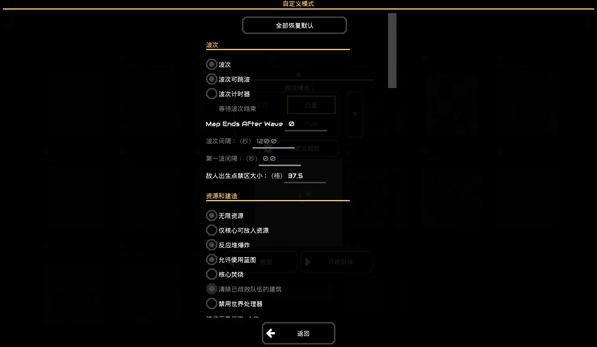

# 局内游戏规则更改
原版已经替我们做好了（）
  

### 预设
游戏里面自带的预设（游戏模式）有4种：生存，进攻，沙盒，pvp  
游戏内容实装以后，在预设中添加不同的[难度选项](../../../机制&系统/存档系统.md)  
选择模式后再选择游戏难度  
#### 预设的覆盖方式
- 完全替换：将所有规则重置为默认值后，再应用预设
- 覆盖应用：直接将所有相关规则调整至预设状态
