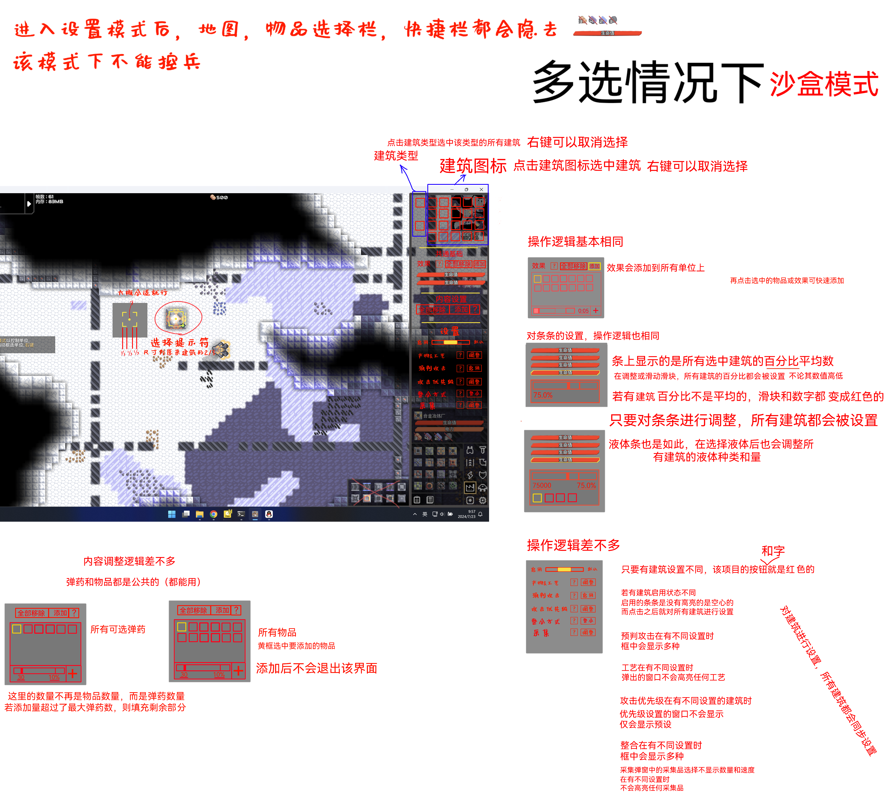
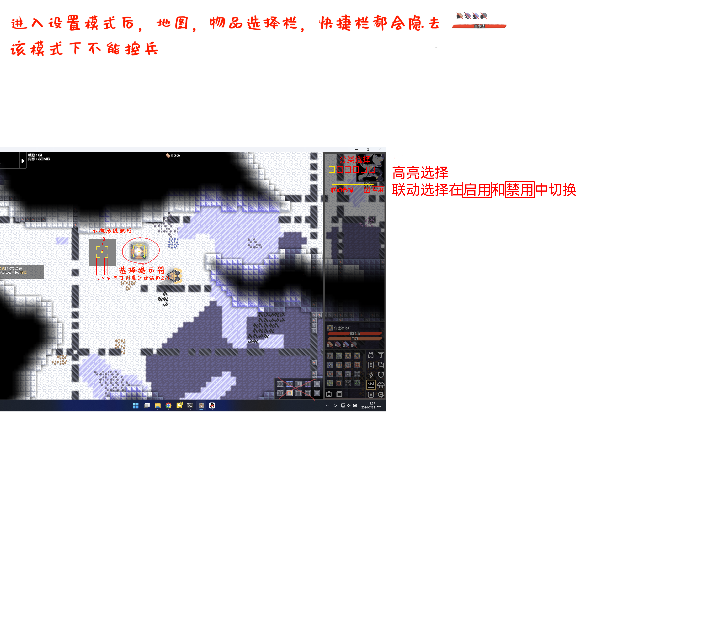

# 便携设置模式
可以对部分建筑（炮台工厂钻头）和单位进行快捷设置  
非沙盒模式时，主要用于设置采集品和工艺（其实不能算作设置模式，更像原版的拓展）  
沙盒模式下，主要用于快捷测试**部分**建筑  
点击可设置的建筑单位，会以建筑或单位为中心向外弹出类似于分类器选择分类的界面，点击界面外即可关闭  
根据不同的使用频次和“调试”常用功能，对不同建筑提供不同的功能
### 针对不同建筑
有以下便携功能：  
- 是否启用（启用模式）
- 操控模式（仅玩家，AI）
- 生命值无限
- 开启无限火力（[分不同的无限火力模式](仅沙盒/全局无限火力.md)）
- 电力
- 热量
- 弹药选择
- 液体选择

炮台：启用模式，生命值无限，无限火力，电力，热量  
工厂（包括兵工厂）：无限火力和工艺选择  
采集：无限火力和采集品选择  
单位：操控模式，生命值无限
### UI
# 设置模式
对单个或多个建筑进行更加精细的调整  

## 开启
设置模式分为两种状态：建筑模式&单位模式

在功能栏中点击  ，在弹出的窗口中选择：**关闭设置模式**  ；**单位设置** ；**建筑设置**，选择后进入对应设置界面  
## 快捷开启
通过快捷开启，设置模式会默认开启建筑设置，并记住关闭前的**设置模式类型**（建筑或单位），每次进入游戏都重置为建筑设置
点按快捷键 \`   (位于TAB的上面，ESC下面) 快速开启设置模式，再按 ` 退出  
按快捷键**Left Alt**模式快速切换模式（建筑<->单位）   
## 选择设置目标
左键点击可以选中目标，长按可以框中目标，松开选择建筑，右键作用相反，可以取消选择   
在一个模式下转到另一个模式，选中的目标会保存，再次转到该模式时重复选择保存的目标  
退出设置模式时，取消对所有目标的选择  
### 选中动效

## UI样式
可以在设置中调整  
分为悬浮窗口和固定两种
### 悬浮窗口
可以拖动窗口，
  
## 功能
***以下均为选中一个建筑的情况***
#### **1.设置建筑是否启用**  
**启用**  有三种情况，从不，默认，总是。从不和总是可以无视逻辑的操控，对建筑进行强制停用和强制启用。默认就是正常受逻辑控制的状态  
多数情况下，逻辑不与正在设置的建筑建立直接联系，所以，进行该操作时会警告玩家，该操作可能会使某些逻辑失效
### **2.选择产物&工艺**  
部分建筑会有这个操作，用于选择不同产物和不同生产工艺 _具体参考钢冶炼的不同工艺_
### **3.是否启用预判攻击**  
### **4.设置攻击优先级**   
- 对于进入炮台攻击范围的多个目标，炮台有攻击优先级，以达到诸如控制炮台配合，节省弹药等目的  
- 攻击优先级的设置面板是一个排序界面，优先级依次自上而下的判断优先级  
- 我们对一些炮台提供默认预设，通常符合炮台功能    
- 新放出的炮台，优先级会继承上一个相同炮台的优先级排序

 **对于攻击性炮台：**  
 
攻击性炮台，包括以物品，液体，热量为弹药的具有攻击性的炮台，最高攻击优先级默认为距离最近的目标  
最先选择优先建筑或单位，默认为单位，基于这项选择再有以下选择：  

*选择优先攻击单位*
- 最大生命值上限
- 最大生命值
- 生命低于10% _（用于收掉残血单位）_
- 距离核心最近
- 距离自己最近
- 距离自己最远
- 未被施加自己能施加的效果
- 被施加某类效果 *（被施加任何效果的单位，除了自己能施加的效果）*
- 打击方向目标最多 _（穿透，散射和范围炮台特有，该功能同样适用于魔灵）_  

*选择优先攻击建筑*     _（有点超模）_  
在以上操作基础上，额外：
- 某类建筑，根据游戏中的分类来做选择  

***对于辅助性炮台：***   

辅助性炮台，类似于裂解，海啸等炮台，这些主要用于辅助和防御的炮台，优先级设置有略微不同，针对不同的炮台，设置也有不同  
具体需要参考炮台分类下对应炮台描述  

_对于喷液炮台_  
同样要先选择单位或建筑
有以下通用设置： 
- 灭火 _（在拥有可以降温的液体的情况下）_
- 未被施加能施加的效果的目标
- 被施加某类效果的目标
- 距离最近的目标

***沙盒模式下额外：***  
1. 设置建筑内部物品  
可以直接添加或删除建筑内的物品，包括液体和已装载弹药  
可以设置无限

2. 更改建筑基础属性  
### 5.选择采集物品
### 6.整合带整合方式设置
### 7.设置攻击限制
用于炮台，限制炮台攻击某种攻击目标，没有先后顺序，符合即生效，默认未空  
可以多选限制目标： 
- 最大生命值低于自身单次伤害
- 最大生命值低于自身每秒伤害
- 生命值低于自身单次伤害的300%
- 生命值低于自身每秒伤害的300%
- 建筑
- 单位
- 目标数量数目过少（一旦该限制，其他限制不再生效）
## UI
非沙盒模式下的UI示意

------
沙盒模式下

---
多选建筑时

---
未选建筑时

---