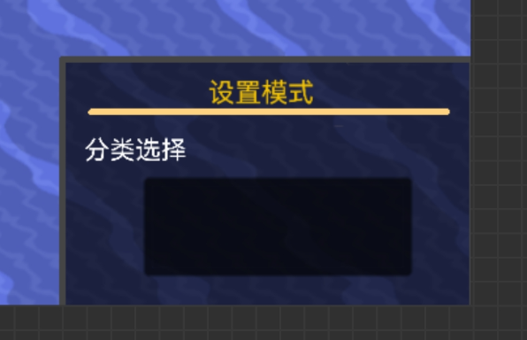
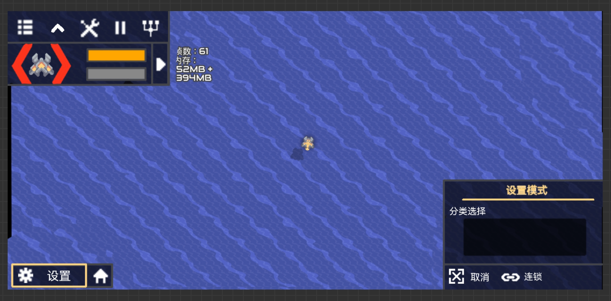
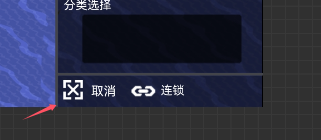
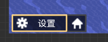
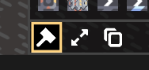
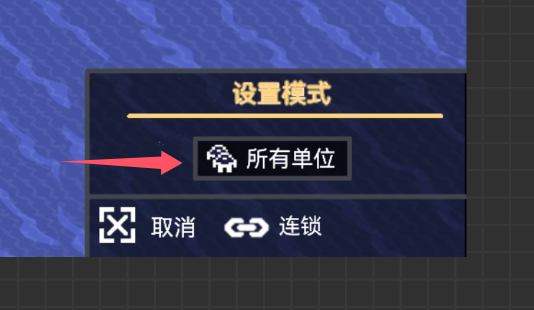
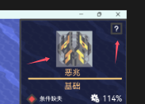
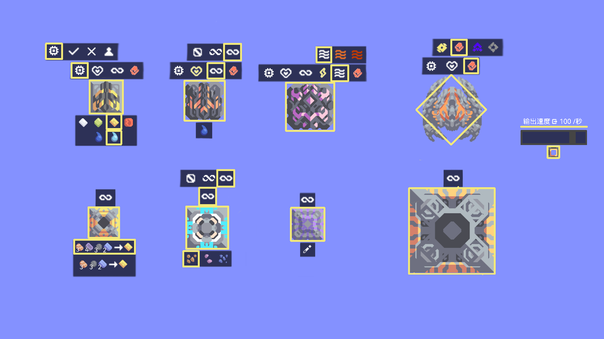
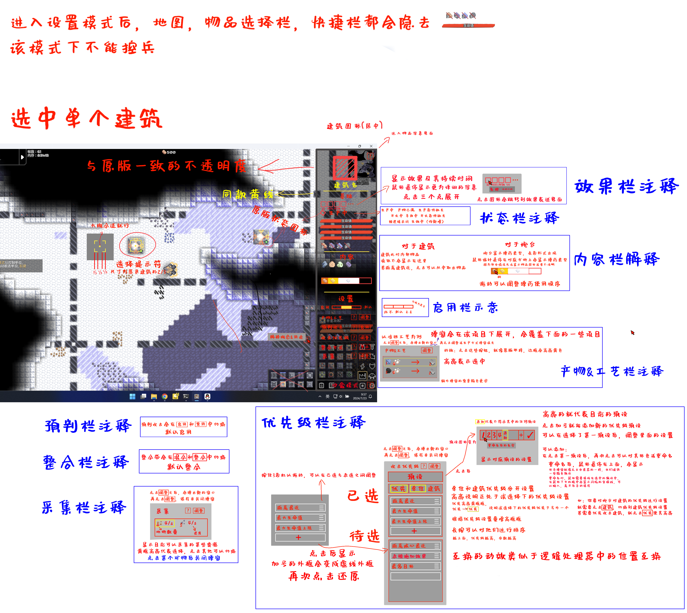

# **设置模式多数功能趋于完善，但由于手机版加入比较突然，需要全部从头来一遍**  
# 还有一些在此之前没有提到的操作细节都进行了补充
下面不会提到的删除/调整的内容：

- 生命值条不再能调整生命值
- 炮台攻击预设不再会继承上一个建筑的预设
- 内容栏不再显示弹药条，因为实在没有什么实际用途

# pc端UI

## 开启
在功能栏中点击  启用设置模式  
打开设置模式后，禁用Shift键开启指挥模式  
### 快捷开启
点按快捷键 \`   (位于TAB的上面，ESC下面) 快速开启设置模式，再按 \` 退出  
### 切换模式
设置模式分为两种状态：建筑模式&单位模式  
默认开启**建筑设置**，并记住关闭前的**设置模式类型**（建筑或单位），每次进入游戏都重置为建筑设置  
按快捷键**Left Alt**切换模式（建筑<->单位） 
切换模式的时候，会在屏幕地下显示**已切换至设置单位**<->**已切换至设置建筑**  
其中，**单位**和**建筑**为橙色字体

  
在建筑模式下，显示分类选择  
在单位模式下，什么都没有，空的
  
### 选择目标
- 在建筑模式下仅能选中建筑，在单位模式下仅能选中单位  
- 左键点击可以选中目标，长按可以框中目标，松开选择目标，右键作用相反，可以取消选择  
在**单位模式**下，点按**G**可以选中所有单位（指挥模式中全选单位的操作）  
在沙盒模式下，可以选中不属于自己队伍的目标  
双击选择 **屏幕内所有相同单位** 或 **连起来的相同建筑**  
- 切换模式后，选中的目标会保存，再次转到该模式时重复选择保存的目标  
退出设置模式时，取消对所有目标的选择  
- 在选中多个目标时，在设置界面点击图标可选择特定目标，右键图标即可取消选择  
#### 选中动效
建筑：原来模样，加一个黑色描边
单位：六边形扣三个洞和中间的点（适应最新版选中单位的效果），黑色描边
删除时，选中框变红，松开便消失  

# 手机端UI  

这些按钮是手机版特供  
  
大部分逻辑差不多，下面只阐述不同之处  
## 开启
点击开启后，功能栏被隐藏（扩展功能栏不会），功能栏位置变为  
  
类似手机端指挥模式  
点击  **设置** 关闭设置模式  
 代表建筑模式，点击转换为  单位模式
## 选择  

- 点按选择目标，长按框选目标  
- 点击  进入取消选择并高亮黄框，点按取消选择目标，长按框选  
高亮黄框与下面的类似，但是会把文字一起框选  

- 点击  进入连锁选择并高亮黄框，点击即电脑端的双击选择**屏幕内所有相同单位** 或 **连起来的相同建筑**，此时框选可多种目标连锁选择 
- 在单位模式下，点击  **所有单位** 会选择所有单位，即电脑点按**G**选中所有单位  

## 选择后UI
不显示当前建筑的图标  
  
其他一毛一样
# 功能
UI和操作逻辑大部分没有改动且电脑和手机差不多  
主要描述对建筑的设置，而对单位的设置会特别说明
## 基础  
显示基础信息  
也就只有效果设置（沙盒）  
效果的添加与删除的逻辑与添加物品趋同  
**单位同样**
## 内容栏（单位无）

#### 1.（仅针对核心）填充或移除
填充即填满核心，移除即移除核心所有资源
#### 2.内容的调整
**新增**，在沙盒模式下，右击可直接删除对应物品  
在添加物品界面右键图标快捷添加无限对应资源
## 设置栏
根据使用频率和习惯，以下排序即为设置栏排序

### 1.设置建筑是否启用  
有四种情况，从不，默认，总是，仅玩家。  
除了默认外，其他情况都不会受到逻辑的控制   
仅玩家：玩家可附身炮台特有，该状态下的炮台，仅玩家可以控制其开火，主要用于测试  
部分情况下，逻辑不与建筑建立直接联系，所以，进行该操作时会警告玩家，该操作可能会使某些逻辑失效  

**对于单位**  
只有仅玩家和默认两种：  
默认：受逻辑，指挥模式和ai的控制  
仅玩家：只有玩家附身时才能操控单位和控制射击（指挥模式也不行）  

**对于核心**  
只有从不和默认两种，用于限制核心对外输出

### 2.设置所属队伍（不变）（单位同样）（沙盒）
### 3.生命值（不变）（单位同样）（沙盒）
### 4.[设置无限火力](仅沙盒/全局无限火力.md)（沙盒）
可以选择 **关闭** & **弱** & **强**
### 5.选择采集物品&调整分类器分类&产物和工艺
多一个调整分类器选择，其他不变
## 攻击策略（大改）（单位无）
作为一个单独的界面，统一设置预判，优先级，限制  
伤害型炮台（厄兆）和辅助型炮台（海啸），可以设置他们的攻击策略，以适应炮台本身的攻击效果   
可以临时设置，但最好通过预设的方式对建筑进行设置   
炮台默认不添加预设  
预设的规则遵循[覆盖应用原则](仅沙盒/局内游戏规则更改.md)（有设置的覆盖，默认的不管）
#### 1.是否启用预判攻击
分为**开**，**关**
#### 2.设置攻击优先级   
 
最先选择优先建筑或单位，默认为单位（液体炮台还有**灭火**，
若弹药不能灭火该优先级无效），基于这项选择再有以下选择：  

- 最大生命值上限
- 最大生命值
- 生命低于10%（玩家可指定） 
- 距离核心最近
- 距离自己最近
- 距离自己最远
- 未被施加自己能施加的效果
- 被施加效果 *（被施加任何效果的单位，除了自己能施加的效果）*
- 打击方向目标最多 
- 可摧毁炮弹
- 被施加玩家指定效果

攻击优先级对单位和建筑分开设置    
#### 3.设置攻击限制
用于炮台，限制炮台攻击某种攻击目标，没有先后顺序，符合即生效，默认未空  
可以多选限制目标： 
- 最大生命值低于自身单次伤害
- 最大生命值低于自身每秒伤害
- 生命值低于自身单次伤害的300%（可指定）
- 生命值低于自身每秒伤害的300%（可指定）
- 建筑
- 单位
- 目标数量数目过少（可指定）
- 可摧毁炮弹
### 攻击策略预设编辑

- 原来的界面不再支持对预设的编辑  
- 点击**预设**，会以**预设**为中心向旁边弹窗，弹窗显示当前的预设种类，共能显示4个，滚轮上下滑动  
若没有位置弹出窗口，则保证窗口全部显示在屏幕内（win的右键菜单）
- 点击即可应用预设，再次点击取消选择并重置攻击策略至默认状态
- 选中预设的预设高亮黄框，若预选的设置被更改，不高亮任何预设
#### 预设的管理
- 悬停**管理**高亮黄框，点击后进入到管理预设界面，点击**返回**或按**ESC**退出  

- 选中预设后会在左边显示当前所有预设
- 未选择预设时，右侧界面显示**请选择预设以编辑**
- 悬停高亮黄框，点击预设选中并常亮黄框，右边显示选中预设的内容  
- 操作逻辑与原来大致相似  
- **其中，选择默认的选项不会更改原来的攻击策略设置**
- 点击**重置**，会重置到上次保存状态

# 便携设置模式（pc独占，这个不急）
可以对部分建筑（炮台工厂钻头）和单位进行快捷设置  
非沙盒模式时，主要用于设置采集品和工艺（其实不能算作设置模式，更像原版的拓展）  
在设置或功能栏中打开**便携设置**后，沙盒模式下，可快捷测试**部分**建筑和目标（主要为炮台单位）  
点击可设置的建筑单位，会以建筑或单位为中心向外弹出类似于分类器选择分类的界面，点击界面外即可关闭  
弹出的界面会随着目标进行移动，  
根据不同的使用频次和“调试”常用功能，对不同建筑提供不同的功能  
### 针对不同建筑
- 炮台：启用模式，生命值无限，无限火力，热量，所属队伍
- 工厂（包括兵工厂）& 发电厂等功能性建筑：无限火力 
- 采集：无限火力和采集品选择  
采集品选择可以直接做成常驻功能，不需要打开便携设置模式  
- 墙体：无限生命，所属队伍
- 运输（管道一类）：没有任何选项
- 单位：启用模式，生命值无限，所属队伍
- 内容源：可调节输出速度，液体最大为无穷，因为液体输出跟帧率有关，也可以做成常驻功能  

**所有功能**  
悬停高亮背景并显示对应操作的名称（类似分类器选择物品）  
若有两个以上选择的，点击会**以图标位置为中心**，向上弹出额外选择弹窗，黄框为已选中   
若只有两种状态的切换，点击即可   
右击可快速轮流切换不同的模式   
- 启用（启用模式）（仅玩家，默认AI ，总是  ，从不  ）  
单位的启用模式只有仅玩家和默认AI，两种
- 生命值：无限变为金色
- 队伍：仅有**黄红紫灰**可选，后续添加我们的队伍可以加入到这里
- 无限火力（[分不同的无限火力模式](仅沙盒/全局无限火力.md)）：关闭；弱无效火力；强无限火力
- 电力：无限变金色
- 热量 ：关闭  ；100%效率 （橙色）；满效率 （红色）
- 弹药选择（对应图标）
- 液体选择（对应图标）
--------------------------------
# 早期珍贵资料（还能参考参考）
非沙盒模式下的UI示意

------
沙盒模式下

---
多选建筑时

---
未选建筑时

---