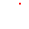

# 镜头模式（独立于原版）
若原版的脱离镜头开启，这个功能自动恢复默认
## 开启和切换
在功能栏点击图标切换模式  
按**F4**可以快捷顺序切换，长按一小段时间（0.5s）弹出轮盘选择，轮盘下面显示当前选中的模式名称
- 默认镜头：电脑端wasd移动，电脑默认模式，手机端没有
- 跟随镜头：手机端默认模式，单位会跟随镜头移动
- 灵魂出窍：灵魂出窍后，玩家操控的单位不会再跟随镜头移动

选中后，在屏幕正下方显示 `镜头模式切换至 默认镜头` ，默认镜头部分为橙红色  

在非默认镜头下，  
按 shift 加快镜头移动（原版，不知道是多少）   
按 ctrl 减慢镜头移动速度（40%）  
（进阶操作）同时按住时，滚动滚轮可以调整常态镜头移动速度  
调整时，在屏幕正下方显示 `镜头移动速度 100%`  
最低即按 ctrl 时的速度，最高按 shift 的速度  
速度数值保存至任何存档

## 额外功能
### 单位自动索敌
即手机版自带的功能，功能栏点击  开启，电脑默认关闭，手机默认开启
### 漫游建造
在功能栏中点击  打开，默认关闭  
非默认镜头下生效  

建造单位会根据玩家放置建筑的顺序，建造建筑   
这里可能要设计一个算法，保证单位可以很好的衔接下一个建筑的建造  
根据不同的搭配，单位建造建筑有不同的移动逻辑：
1. +跟随镜头  
单位会尽量靠近镜头，但不能移动至建造范围外  
2. +灵魂出窍  
没有限制的造建筑，这样搭配，更像指挥单位去造建筑了 

#### 漫游建造算法提议
可以设计成让单位同时处于正在建造建筑和下一个建筑的范围内，但绝对不能超出正在建造建筑的范围

# 增大缩放范围
提供一个选项，可以增大缩放的范围和灵敏度