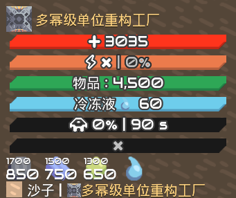
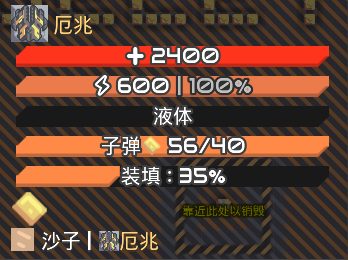

# 更加精细的数据显示
以下都是从学术端截图下来的参考
## 基础数据细化
生命值，液体，弹药，电力等拥有了更加精细的数据显示，玩家能在设置中挑选并设置  
所有百分比显示都是灰色的，与前面的内容 空一格 来区分
- 生命值：显示具体数值和百分比  
- 液体：具体数值  
- 电力：显示目前效率百分比  
- 弹药：剩余可发射次数/剩余弹药数
- 单位建造进度：百分比和预计时间（算加速后）
- 电量储量：百分比
### 新增数据
- 装填进度：百分比
- 生产进度：百分比

## 建造消耗预计
统计建造时花费的材料和时间，
显示在鼠标旁
## 建筑内容物查看自定义
可以在一定范围内自定义一行展示的物品数量  

## 显示单位索敌范围
鼠标悬浮在单位上显示  
仅显示我方  

## 显示当前 炮台/单位 索敌目标
当鼠标悬浮在炮台或单位上时，显示其索敌目标  
显示的样式即原版进入建筑时的光标  

## 建筑和单位信息同时显示
避免单位遮挡看不见其下方建筑的信息  

## 分类器显示物品图标
显示图标的情况下，背景不透明度降低至较为舒适的程度  

## 质驱发射方向显示
可调常亮和仅鼠标悬浮，默认关闭
##