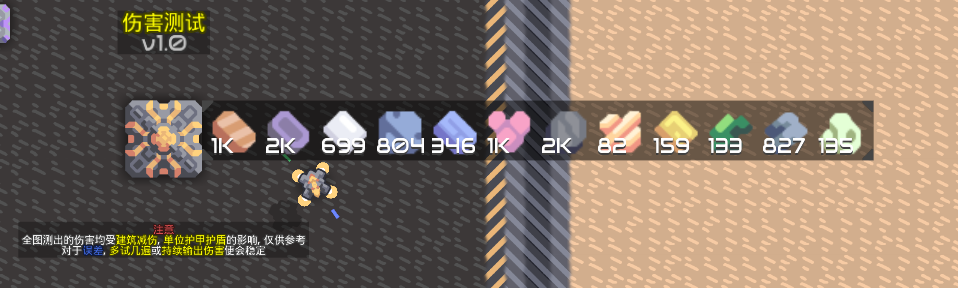
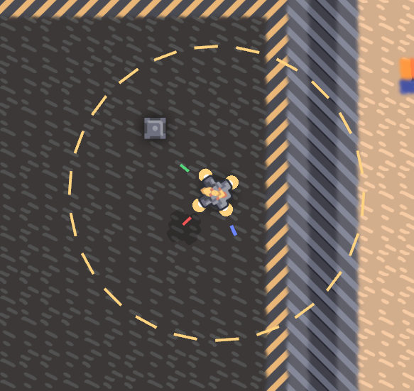
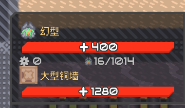
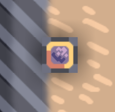

# 资源栏大改
我们加入了很多的物品, 会让资源栏过大, 遮挡视野.  
对原版的资源栏位进行优化：  
- 每一行展示的物品内容增加，玩家可自行调整，至多12个（根据实际调整）
- 每个区块对资源栏显示的设置独立
- 可以选择忽略部分物品的数量，按快捷键F2快速切换
- 可以限制资源输出（到达指定资源数量以下停止输出），默认为核心总量的10%，转移到设置模式，对核心设置即可
# 受击警告
玩家放置的相关建筑会显示在资源栏附近，可以设置不同的图标以表示受击位置  
点击对应图标视角会移动到发出告警的建筑  
按F3会移动到第一个图标的位置  
核心自带该功能
# 电量辅助显示
连在一起的所有电力节点和电池为一个电力体系  
显示整个区块所有不同体系电力节点的电力和电量，显示在资源显示栏下，可以改变显示哪一个体系的电力和电量  
玩家也可以改变相对（资源栏）位置
# UI
- 以下所有颜色变化的变更都是有0.5秒的过渡时间，这样不会太突兀  
- 颜色采取原版建筑状态灯的颜色  
- 闪烁时间什么的调整到比较舒适的程度即可  

# 建造消耗预计
统计建造时花费的材料和时间，
显示在鼠标旁
# 建筑内容物查看界面自定义
可以在一定范围内自定义一行展示的物品数量  

# 显示单位索敌范围
鼠标悬浮在单位上显示  
仅显示我方  

# 显示当前 炮台/单位 索敌目标
当鼠标悬浮在炮台或单位上时，显示其索敌目标  
显示的样式即原版进入建筑时的光标  
  
若玩家正在操控炮台或单位（除玩家单位外），鼠标会变成  
  
这个图标就是玩家操控单位自动索敌时的  
仅限装填速度高于1秒的建筑，在这个图标以下，会显示装填状态的进度条
# 建筑和单位信息同时显示
避免单位遮挡看不见其下方建筑的信息  

# 分类器显示物品图标
显示图标的情况下，背景不透明度降低至较为舒适的程度  

# 质驱发射方向显示
可调常亮和仅鼠标悬浮，默认关闭
# 

