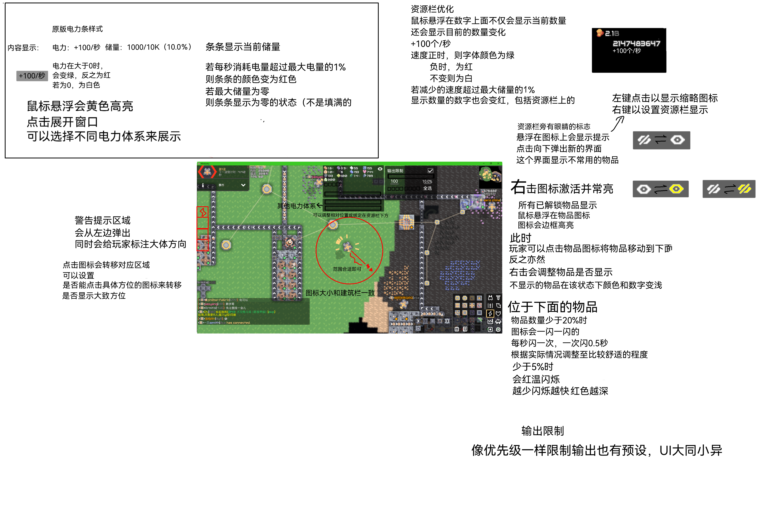

# 资源缩略
我们加入了很多的物品, 会让资源栏过大, 遮挡视野.  
对原版的资源栏位进行优化：  
- 每一行展示的物品内容增加，玩家可自行调整，至多12个（根据实际调整）
- 每个区块对资源栏显示的设置独立
- 可以选择忽略部分物品的数量，按快捷键F2快速切换
- 可以限制资源输出（到达指定资源数量以下停止输出），默认为核心总量的10%，转移到设置模式，对核心设置即可
# 受击警告
玩家放置的相关建筑会显示在资源栏附近，可以设置不同的图标以表示受击位置  
点击对应图标视角会移动到发出警告的建筑  
按F3会移动到第一个图标的位置  
核心自带该功能
# 电量辅助显示
连在一起的所有电力节点和电池为一个电力体系  
显示整个区块所有不同体系电力节点的电力和电量，显示在资源显示栏下，可以改变显示哪一个体系的电力和电量  
玩家也可以改变相对（资源栏）位置
# UI
- 以下所有颜色变化的变更都是有0.5秒的过渡时间，这样不会太突兀  
- 颜色采取原版建筑状态灯的颜色  
- 闪烁时间什么的调整到比较舒适的程度即可  

