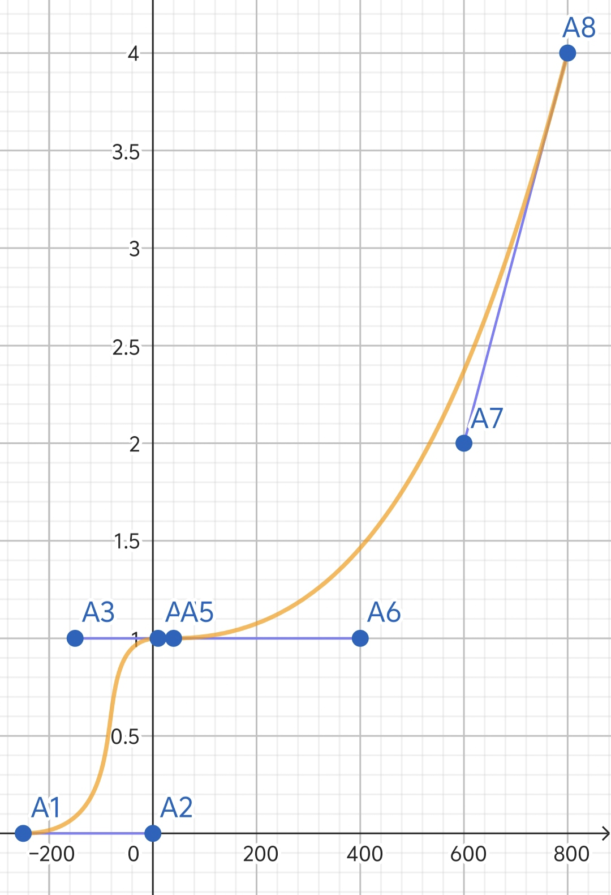
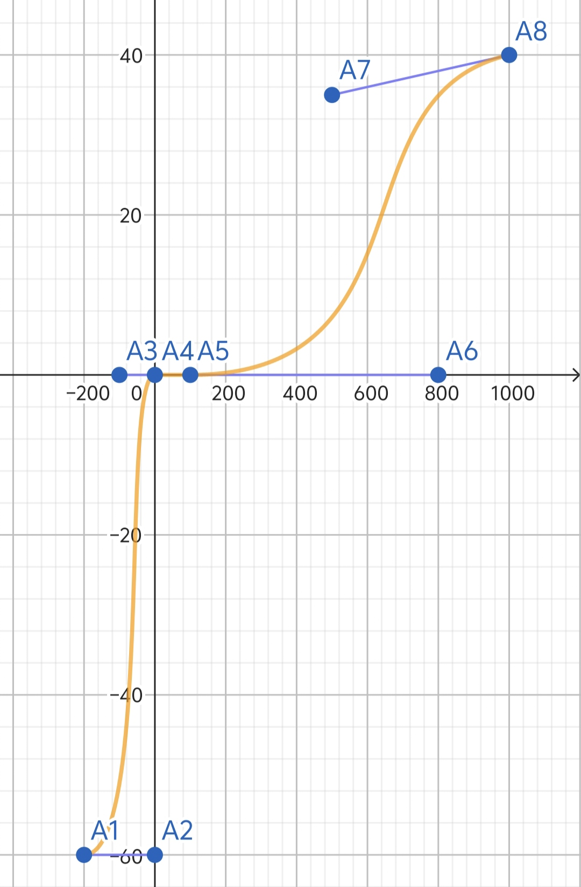

 # 环境系统  
 新的系统可以在设置里开关，但是如果要玩fc内容，这一项必须打开  
 环境有几种衡量指标：
 - 温度（热量）
 - 湿度（新增）
 - 光照  
每一个图都有自己属于的**全局环境属性**，不同的地形可能影响区域的环境属性  
## 温度（热量）
- 温度用原版的热量模拟，每一个地块都有自己热量属性，默认值都为零，全局环境设置里，赛普罗的热量属性默认为-0.4，埃里克尔为0，帕西维尔为-0.1  
温度受到地块，天气等影响，同时，处于不同纬度会影响其默认值，默认赤道为+0.2，往极地缓慢降低为-1.6  

- 地块新属性：温度  
绝大部分地块不影响地块热量，发热地块热量是可以向外辐射热量的，吸热地块同样  
不同天气对热量影响的调整有 **乘算和加算** 两种  
这些地块附有的热量，会对放置在上面的建筑有影响，基本就是直接 **扣除/增加** 需热建筑的热量（包括导热建筑） 和 **降低/增加（加算）** 散热建筑的效率
$$
效率变动= - (\frac{热量}{2})^2\  \% \ \ \ ( 热量>2)  
$$
$$
效率变动= +(\frac{热量}{2})^2\  \% \ \ \ (热量 < -2)  
$$
$$其余情况为\ 0\ \%$$
### 温度辐射范围
辐射范围由地块本身热量决定： 
$$
辐射热量 = 地块热量\cdot (\frac{1}{4})^d  
$$
d 为距离中心的距离  
结果上取整  
当辐射热量值低于0.5时不再向外辐射

### 辐射区域重合  
重合并不是简单的相加，而是有限制的  
一个地块的热量上限为：最高 辐射热量 的 1.5倍  
$$
地块总热 = 第一高热量 + \frac{第二高热量+第三高热量+...}{2\cdot第一高热量}
$$
热量有负有正时，正负分开计算后再求和
## 湿度
- 湿度也是，每一个地块都有自己的湿度属性，湿度为百分比属性，上限为250%（现实中水有自己的蒸气压，湿度也是有上限的，但不代表上限不能突破），默认值都为零，全局环境设置里，赛普罗的湿度属性默认为20%，埃里克尔为5%，帕西维尔为30%  
湿度受到地块，天气等影响  
- 绝大部分地块不影响地块湿度，含水地块会向外辐射湿度，吸水地块同样  
地块附有的湿度可以对部分湿度敏感的建筑造成影响，
## 湿度辐射范围
辐射范围由地块本身湿度决定：  
$$
辐射半径 =1（本身） + 湿度\cdot 6
$$
结果向下取整  
区域内，地块向外辐射的湿度 **线性递减**
### 辐射区域重合  
$$
地块总湿度 = 第一高湿度 + \frac{第二高湿度+第三高湿度+...}{200\cdot第一高湿度}
$$
有负有正时，正负分开计算后再求和
## 光照
就是原版的光照系统  
与湿度算法一致  
 
## 影响环境的地块 
新地块属性，热量，湿度，光照度     
通常为可以放热吸热，含水吸水的地块  

这里只列出一些地块供测试，后面仍然要修改更多地块
1. 矿渣  
热量 +12 ，湿度 +60% ，光照度 +100% 
2. 灼热岩石  
热量 +10， 湿度 +30% ，光照度 +40% 
3. 熔融岩石  
热量 +6.5， 湿度 +10%  ，光照度 +10%
4. 浅水 水 深水  
热量 0， 湿度 +100% +125% +150% ，光照度 0%
5. 冷冻液  
热量 -6 ，湿度 +70% ，光照度 0%
6. 各种喷口  
热量 +1， 湿度 +80% ，光照度 0%
7. 雪 冰雪 冰   
热量 -2 -3 -5，湿度 +50% +40% +30%，光照度 0%
8. 草地  
热量 0 ，湿度 +55%，光照度 0%
9. 芳油  
热量 +0.5 ，湿度 +30%，光照度 0%
10. 盐碱地  
热量 0 ，湿度-65%，光照度 0%
## 建筑工作受环境影响
### 新的属性-绝热性
绝热性用来衡量建筑与外界热交流的快慢，可负可正  
绝热性由材料的绝热性能决定，但也可以自己设定  
$$
绝热性 = 2\cdot\frac{绝热材料总量}{耗材总量}\cdot绝热材料的绝热性
$$
绝热性不是绝对的，会受天气，效果的影响  
100%为完全绝热，但是可以被一些因素影响  
由这个方式决定的绝热性最大为400%
### 建筑单位接受外界热
建筑地块受热取平均，单位只受单个地块的影响
$$  
外界热 = \frac{各个地块热量和}{地块数}（湿度和光照都是如此，取平均） + 效果影响
$$
  

建筑单位最终受到的外界的热：
$$
实际外界热 = 外界热\cdot(1-绝热性)
$$

### 原版物品的绝热材料和效果影响
1. 石墨：60%绝热性
2. 塑钢：30%绝热性
3. 湿润：-10%绝热性，-0.5热量（加在外界热上，下面同理）
4. 燃烧： +2热量
5. 融化： +6热量
6. 冻结： -3热量
## 原版赛普罗需热建筑 埃里克尔 化 
（参考标准）地热发电机需5点热量，满效率340%，需要17热满效率 
1. 热量发电机  
标准5点热，满效率340%
2. 热能坩埚  
标准0点热，满效率200%，要12点热

## 原版可以用于测试的建筑
1. 大气收集器  
除了收集氮气外，还可以收集水

# (珍贵资料)
 # 热量化
- 热量不再是一个实时的量，而是可以储存的，存储热的量叫热容量，简称热容
- 热容量是每个建筑的固有属性，就如液体容量一样
- 需热建筑效率计算：
$$
效率=\frac{当前热容量}{最大热容量}\cdot最大效率
$$
- 建筑工作时消耗热量的速率：
$$
耗热速率=效率\cdot100\%效率时的耗热速率
$$
- 消耗热的速率受温度和地块特性影响
-----
# 基础环境系统
包括温度湿度光照等,这些都是一个区块的固有属性,根据现实的地理学来设计地区的温度湿度光照等,主要用于计算热量消耗,冷却液消耗和对[自生合金]的影响
## 温度
- 影响需热建筑,散热建筑和[自生合金]相关建筑单位
- 温度取决于区块的经纬度和地形地势,区块的一些地块会影响其他地块的温度,也是主要因素,之间呈加算关系 `如:岩浆块等等`
- 每个地块都有自己的温度数值,建筑会采集自己所占地块的平均作为数据,单位仅仅只采集自己几何中心的地块作为数据
- 天气会极大影响温度
### 热交换能力
需热和散热建筑的固有属性，描述建筑对热量的交换能力，数值越高，热交换能力越强
### 热利用效率(温度系数)
计算热量的利用效率和冷却液消耗速率,根据当前温度有下图算法:  
定义计算符号:  
温度系数 $T$  
温度 $D$  
热交换能力 $H$  （通常为100）  
天气因素 $W$   
温度系数基数 $F$  

图中 $x$轴为$F$，$y$轴为$D$
$A_1(-250,0)$  
$A_2(0,0)$   
$A_3(-150,1)$   
$A_4(10,1)$   
$A_5(40,1)$   
$A_6(400,1)$   
$A_7(600,2)$   
$A_8(800,4)$  

$A_1$以左全为0，$A_8$以右为$A_7$和$A_8$的连线
$$
T=F^{\frac{H}{100}}\cdot W 
$$
**对于需热建筑:**  
外部供热会受$T$的影响,算法:
$$
实际供热速率=外部供热 \cdot T
$$
**对于散热建筑:**  
消耗冷却液的速率受$T$影响,算法:  
$$
实际消耗速率=建筑原生消耗速率 \cdot T
$$
### 地块供热
温度过高的地块会给建筑提供热量,与外部热量一起加算,算法:  
定义计算符号:  
供热量$H$  
温度$D$  
下图为算法

图中  $x$轴为 $H$，$y$轴为 $D$
$A_1(-200,-60)$   
$A_2(-60,0)$   
$A_3(-100,0)$  
$A_4(0,0)$  
$A_5(100,0)$  
$A_6(600,0)$   
$A_7(500,35)$   
$A_8(1000,40)$  

$A_1$以右为-60，$A_8$以左为 $A_8$和 $A_7$的连线
### 自生合金的独特计算
参考生物的生长，对于所有以自生合金为原材料的单位建筑运用以下计算温度系数的算法
## 湿度
与温度的影响因素类似
- 湿度同样取决于经纬度地形地势的影响
## 光照
与原版一致,只是一些天气和地块会影响一些地方的光照