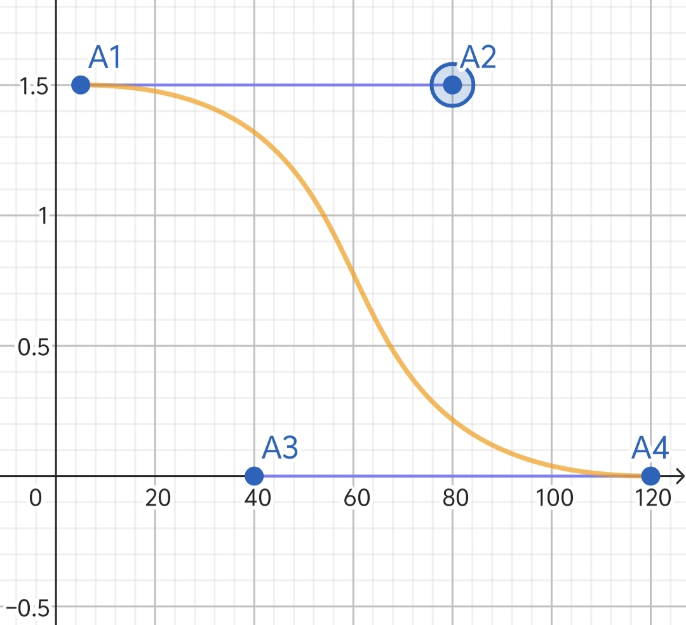

# 索敌机制
设置优先级后的炮台，优先级最高的作为攻击目标
但是攻击优先级会被**嘲讽机制**覆盖  
## 嘲讽与隐蔽机制
_不会对玩家“附身”的单位生效_  
嘲讽与隐蔽可以影响单位和炮台的索敌   
最简单来说，嘲讽可以无视攻击优先级，而隐蔽可以不会成为锁定目标
### 单位炮台新属性
新属性默认值都为0，为0时不会在属性面板显示
- **嘲讽强度（Taunt Intensity）**
- **嘲讽抗性（Taunt Resistance）**
- **隐蔽能力（Stealth Intensity）**
- **寻迹能力（Tracking Precision）** 
  
***嘲讽与隐蔽二者并不冲突***
### 算法     
隐蔽优先于嘲讽  
#### 嘲讽
嘲讽力度超过0后，攻击优先级和限制无效，单位炮台会优先锁定嘲讽力度最高的单位  

$$
嘲讽力度 = 目标嘲讽强度\cdot(0.5+(1-\frac{距离}{索敌范围})^2)- 自身嘲讽抗性 
$$

#### 隐蔽
隐蔽性超过0后，单位炮台不会主动锁定目标  

$$
隐蔽性 = 隐蔽状态\cdot(目标隐蔽能力\cdot(0.5+(1-\frac{距离}{索敌范围})^2) - 自身寻迹能力)
$$
隐蔽致默认为2  
目标在移动时，隐蔽状态会以0.5/秒降低至0.5，停下来会涨回  
目标攻击时，隐蔽状态会以1.6/秒降低至0.2，停下涨回  
目标攻击到任意目标时，隐蔽状态会瞬间降为0.2，2秒后才会涨回  
涨回速度为0.8/秒

# 早期珍贵资料
被迷惑对象索敌范围内出现施加迷惑的单位或建筑，才会进行下面的判断  
A为被迷惑对象，B为施加迷惑的对象
定义计算符号： 
- A的抗诱力→$K$（抗） 
- A的向量坐标→ $\vec{A}$
- A的移动速度向量或炮台的朝向向量→$\vec V$
- B的迷惑力→$M$（迷）     
- B的向量坐标→ $\vec{B}$   
- 嘲讽度→$C$（嘲）   
- 方向影响因素→$D$  
- 距离影响因素→$J$（距）
- AB相对方向→$\vec{C}$
- A的索敌范围→$F$（范） 
$$
\vec{C}=\vec{A}-\vec{B}\\
$$
$D$用cos计算方向因素
$$
D=\cos＜\vec{V},\vec{C}＞+2
$$
$J$的特殊算法，结合贝塞尔曲线计算  
具体参考下图，其中x轴为 $|\vec C|$（距离），轴为 $J$

$A_1$点固定为（5($x_1$)，1.5）  
$A_4$点y轴固定为0，x轴为以下算法
$$
x_4=3\cdot\sqrt F+120
$$
$A_2$点y轴固定为1.5，x轴为以下算法
$$
x_2=\frac{2}{3}\cdot（x_4+x_1）
$$
$A_3$点y轴固定为0，x轴为以下算法
$$
x_3=\frac{1}{3}\cdot（x_4+x_1）
$$
嘲讽度算法
$$
C=D\cdot J\cdot M-K
$$
若C＞0，则给单位加分，反之则不加
## 限制级
在 $C＞0$时，限制级不生效
目标在符合任何限制级条件时，都不会索敌攻击

