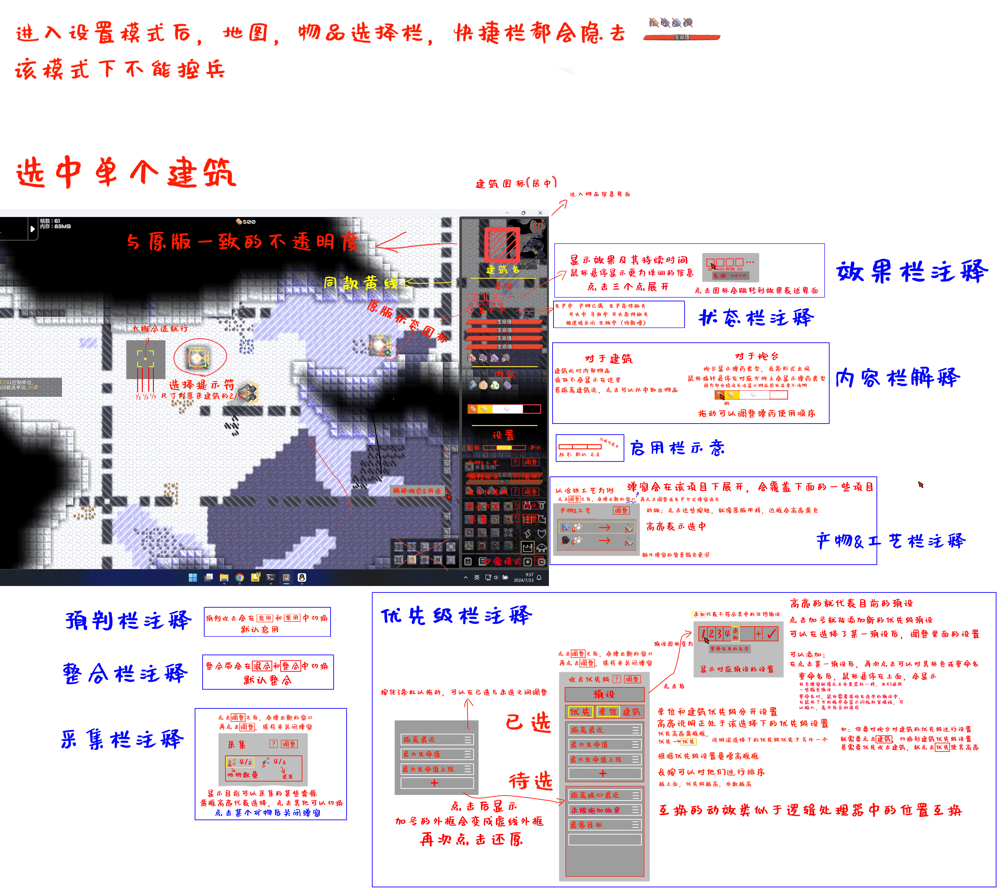

# 操作&优化
对原版进行的部分优化，所有的操作优化, 都作为一个可选项在设置中调整且默认关闭, 避免有些玩家(可能很多)不习惯新的操作模式, 如是否启用轮盘快捷选择 是否启用快捷栏
## 设置模式
用于调整建筑的功能和工作状态，方便对建筑进行调控  
### 操作
点按Ctrl键，进入设置界面，再按退出  
左键点击可以选中建筑，长按可以框中建筑，松开选择建筑，右键作用相反，可以取消选择  
设置界面可以对建筑进行调控，选中不同数量的建筑和不同类型的建筑，有不同操作，遵循对多个对象仅可执行共有操作的原则
### 功能
***以下均为选中一个建筑的情况***
#### **1.设置建筑是否启用**  
**启用**  有三种情况，从不，默认，总是。从不和总是可以无视逻辑的操控，对建筑进行强制停用和强制启用。默认就是正常受逻辑控制的状态  
多数情况下，逻辑不与正在设置的建筑建立直接联系，所以，进行该操作时会警告玩家，该操作可能会使某些逻辑失效
#### **2.选择产物&工艺**  
部分建筑会有这个操作，用于选择不同产物和不同生产工艺 _具体参考钢冶炼的不同工艺_
#### **3.是否启用预判攻击**  
#### **4.设置攻击优先级**   
- 对于进入炮台攻击范围的多个目标，炮台有攻击优先级，以达到诸如控制炮台配合，节省弹药等目的  
- 攻击优先级的设置面板是一个排序界面，优先级依次自上而下的判断优先级  
- 我们对一些炮台提供默认预设，通常符合炮台功能    
- 新放出的炮台，优先级会继承上一个相同炮台的优先级排序

 **对于攻击性炮台：**  
 
攻击性炮台，包括以物品，液体，热量为弹药的具有攻击性的炮台，最高攻击优先级默认为距离最近的目标  
最先选择优先建筑或单位，默认为单位，基于这项选择再有以下选择：  

*选择优先攻击单位*
- 最大生命值上限
- 最大生命值
- 生命低于10% _（用于收掉残血单位）_
- 距离核心最近
- 距离自己最近
- 距离自己最远
- 未被施加自己能施加的效果
- 被施加某类效果 *（被施加任何效果的单位，除了自己能施加的效果）*
- 打击方向目标最多 _（穿透，散射和范围炮台特有，该功能同样适用于魔灵）_  

*选择优先攻击建筑*     _（有点超模）_  
在以上操作基础上，额外：
- 某类建筑，根据游戏中的分类来做选择  

***对于辅助性炮台：***   

辅助性炮台，类似于裂解，海啸等炮台，这些主要用于辅助和防御的炮台，优先级设置有略微不同，针对不同的炮台，设置也有不同  
具体需要参考炮台分类下对应炮台描述  

_对于喷液炮台_  
同样要先选择单位或建筑
有以下通用设置： 
- 灭火 _（在拥有可以降温的液体的情况下）_
- 未被施加能施加的效果的目标
- 被施加某类效果的目标
- 距离最近的目标

***沙盒模式下额外：***  
1. 设置建筑内部物品  
可以直接添加或删除建筑内的物品，包括液体和已装载弹药  
可以设置无限

2. 更改建筑基础属性  
#### 5.选择采集物品
#### 6.整合带整合方式设置
#### 7.设置攻击限制
用于炮台，限制炮台攻击某种攻击目标，没有先后顺序，符合即生效，默认未空  
可以多选限制目标： 
- 最大生命值低于自身单次伤害
- 最大生命值低于自身每秒伤害
- 生命值低于自身单次伤害的300%
- 生命值低于自身每秒伤害的300%
- 建筑
- 单位
- 目标数量数目过少（一旦该限制，其他限制不再生效）
### UI
非沙盒模式下的UI示意

沙盒模式下

多选建筑时

未选建筑时

## 快捷选择
- **建筑选择栏**就是游戏右下角选择建筑的栏位
- **建筑分类**就是在建筑选择栏中的选择建筑时, 最先要选择的分类
- 所有快捷选择方式, 生效后, 都会在建筑选择栏定位并选择
 

1.快捷键
快捷键替代了原版的狗屎快捷键, 用更加简洁的方式去帮助我们去选择建筑, 要点:

1) 快捷键
默认为1-0,可前往设置自定义

2) 快捷栏
- 只显示已经设置好的快捷键,并再建筑右下角标注对应的快捷键,这个其实只是为了美观
- 快捷栏位于**建筑选择栏**的左边,类似于我的世界的快捷栏,可以直接用鼠标点击,可以用快捷键

3) 快捷栏建筑的设置  
快捷栏设置方案:(仅一种)
- 鼠标指向    建筑选择栏位    的建筑, 摁下   设置好的快捷键(默认1-0)   即可设置  
 

2.轮盘  
轮盘是另一种快捷键形式,可以与**快捷栏**共存

1) 操作
按下**默认键Tab**会在以鼠标为中心形成围绕鼠标的轮盘,拖动鼠标到目标建筑后,松开 Tab 即可选择建筑
注意,即使鼠标在轮盘范围外也可以做出选择, 只要方向对即可

2) 种类  
轮盘有4等分和8等分结构,再多就不好用了!

3) 设置  
与快捷栏共同使用一套设置,即1-8分别对应轮盘八个位置,

3.常用建筑栏  
- 显示最常用的建筑(统计选择次数), 位于  建筑选择栏  上方,可以左右滑动查看其他使用频次的建筑
- 同样,玩家也可以自定义显示的建筑频率的前几号,默认5个

4.自定义建筑选择栏(可选加入)
可以自定义建筑的排列顺序,方便直接找到建筑,也映射到**后期不太会用前期建筑的问题**,**部分几乎用不到的建筑的问题**和**部分高频建筑太分开而不好选择的问题**, 因为这些好像都能通过快捷栏解决,所以这个放到最后考虑是否要做

1) 设置
单独的设置按键位于 常用建筑栏 的旁边

2) 操作
单击设置按键, 建筑选择栏 进入编辑状态, 基于选择的 建筑分类 , 建筑选择栏 会被一个新的界面替代,玩家可以长摁拖动更改建筑相对位置
注意,手机长摁会与翻动冲突,长摁时间要注意

5.快速选择键
- 默认键为F(与原版复制冲突),鼠标指着某个建筑的时候按下F不松,建筑选择栏位会定位到对应的建筑,松开即可选择
- 若在空白区域松开,取消选择
## 运输建筑收纳
由于时期较多，运输建筑需要进行一定的收纳  
类似于mc基岩版创造模式的背包，同时期的运输建筑会被收纳成一个格子，点击可以展开   
## 资源显示栏缩略与功能化
### 资源缩略
我们加入了很多的物品, 会让资源栏过大, 遮挡视野.  
对原版的资源栏位进行优化：  
- 可以选择忽略部分物品的数量
- 可以设置资源缺少警告
- 可以限制资源输出（到达指定资源数量停止输出）
### 受击警告
玩家放置的相关建筑会显示在资源栏附近，可以设置不同的图标以表示受击位置  
点击图标或快捷键F3，视角会移动到发出警告的建筑
### UI
## 科技树优化
### 科技树分类
科技树主要分为两类：**分类科技树**和**流程科技树**  
- 分类科技树就是原版的那种类型
- 流程科技树就是按照流程来设计的科技树
### 自定义研究科技
研究科技不再是花费所有区块的资源，而是可以指定消耗资源的数量和区块
### UI

## $Cooker$ $VI$ 行星终端
### 功能
几乎替代了原版的行星地图，但不将其删除  
将多个功能整合整合,在这个界面可以:  
- 查看各个区块的基本信息(连接节点数 电力 产量 攻防状态 区块信号等)
- 控制区块导弹的发射
- 查看资料库
- 查看科技树
- 查看核心数据库
- 打开行星地图
- 进行物流调整   
- 查看当前时间(游玩的时长)  
- 一些奇怪的信息(用帕西维尔文字写的)
### UI
按K可以直接打开该界面

## 增大缩放范围
提供一个选项，可以增大缩放的范围和灵敏度

