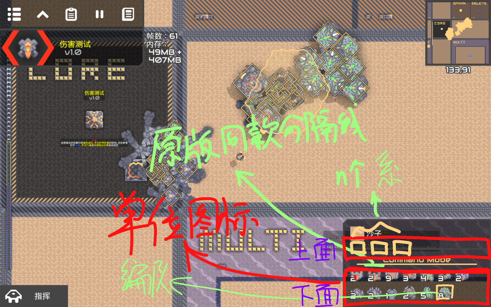
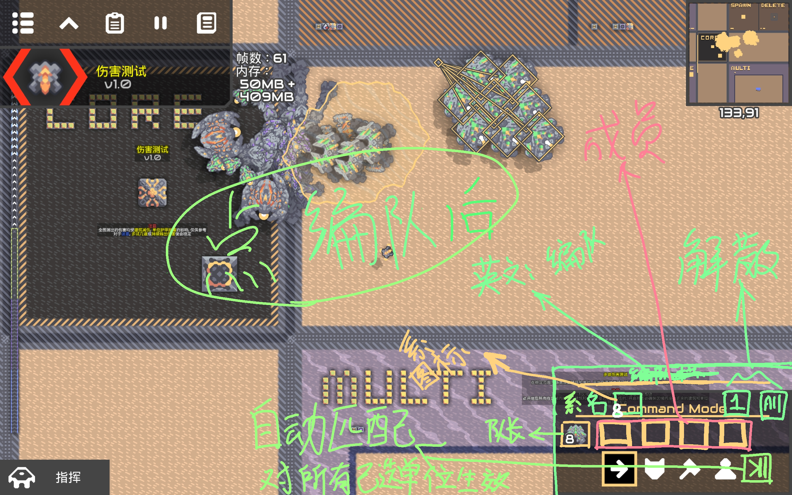
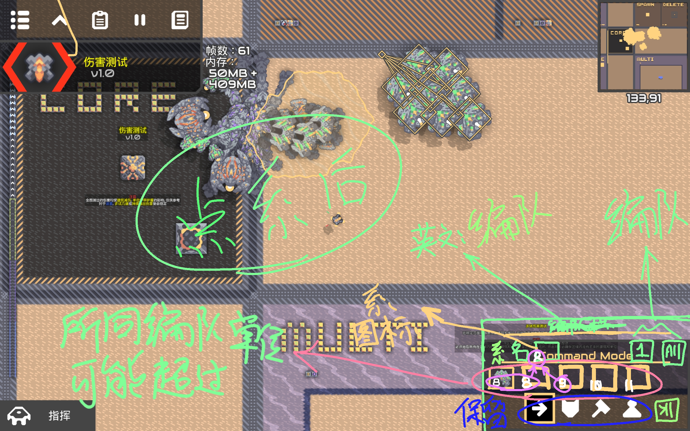

# 单位

## 核心设计&变更

### 编队系统
编队能达成1+1＞2的效果，避免玩家堆死一种兵，而没有策略性  
#### 编队
- 部分单位是隶属于某个**系**，一个**系**中包括至少两种**不同单位**  
- 只有属于某个**系**的单位才能与相同**系**的单位组成**编队**  
- **一支编队至多能容纳一套单位** ，且至少有两个单位才能组成编队  
_如：某一**系**单位仅有一个坦克和两架相同飞机，当坦克和一家飞机组成编队，编队缺失，但依旧可以采用该**系**ai，若再加上一架飞机，该编队就形成了一套单位且不能再增加_  
- 编队后，单位的**ai**会更改为该**系**的专属ai，共同作战  
- 每个**系**都有独立的图标  

不同单位概念分为几种：
- 独立单位，不属于任何**系**的单位
- 已编单位，属于某个**系**的单位，**已经**与同**系**单位组成一个编队
- 编队长，作为**系**的队长，玩家仅能通过控制编队长来控制整个编队
- 未编单位，属于某个**系**的单位，**未**与同**系**单位组成一个编队  

  
***以下有图注释***
#### 控制
- 组成编队    
玩家通过**操控**选中单位，点击**系**图标选中所有同**系**未编单位，再点击**组成编队**即可组成一支编队，若想全部编队，点击**全部编队**即可
- 解散编队  
选中单位后，通过点击**编队**图标选中对应编队长，点击**解散编队**即可解散一支编队，点击**全部解散**即可解散所有编队
#### UI&逻辑
- **系**图标会显示在 _显示单位图标的_ 上面，然后会在图标右下角显示最大组成编队的数量，  用划分线 与 _显示单位图标的_ 下面分开（后称上面 下面），点击后选中所有同**系**未编单位，进入编队界面
- **未编单位** 图标跟独立单位一样显示在下面，而 **已编单位**不显示
- **编队**图标会显示在下面且总是排在前面（优先级高），显示编队数量，点击后选中所有同**系**已编单位，并进入编队界面
- 选中**编队**的某个单位后，会自动选中该编队队长，用黄色框框中，其他附属单位，会用虚线连接编队长，可调不透明度
- 编队界面可对选中编队操作，在点击任何编队相关的按键后，被影响的单位会解绑，在解绑的时候，  
若是解绑，对应编队长的选中框会短暂闪红3次，然后消失，在消失途中，虚线会慢慢淡出  
若是编队，选中框会突然变白一些，然后消失，虚线会显现然后一同消失  
- **自动匹配**图标显示在控制单位下面，组成单位后，默认启用，功能是，处于该状态下的单位会自动寻找未满编队组成编队  
可以在制造单位的时候选择这个，单位会在原地待命，直到出现未满编队
----

### 单位共享容量
- 为平衡性，所有单位共享单位容量，不让玩家总是堆太多单位，人海战术，策略性难行
- 可以将辅助性单位和进攻性单位分开计算单位容量，核心类型不同，提供的不同类型的单位容量不同
### 单位专业化
单位越后期，越专业，但也有不少全能单位，但单向技能不如专业
### 单位弱点化
每个单位,或一类单位都有对应的弱点和某些抗性  
`原版海军t4几乎免疫爆破伤害`

## 新增单位
**空**

## 原版单位调整

>